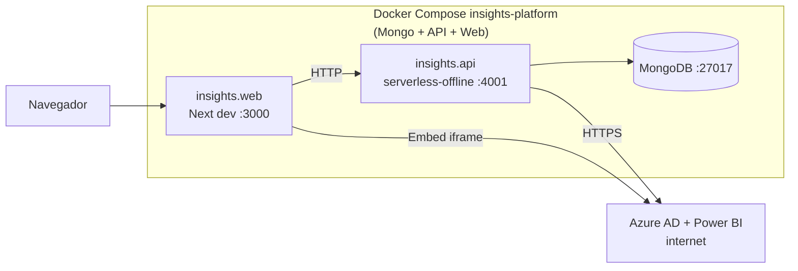
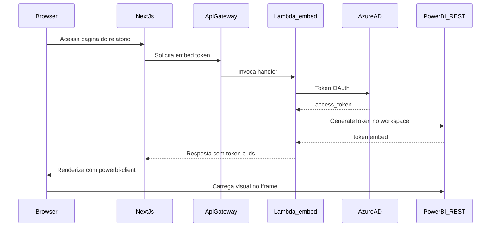

# Insights Platform

Monorepo **Nx** com **`insights.web`** (Next.js), **`insights.api`** (Serverless / Lambda + MongoDB), multi-tenant e integração **Microsoft Power BI** (Azure AD + embed).

**Repositório:** [github.com/reluviari/insights-platform](https://github.com/reluviari/insights-platform)

## Demo / ambientes

Não há URLs públicas de demo fixas: **front e API em produção dependem do deploy da sua organização** (AWS, tenant, credenciais Microsoft). Para desenvolvimento local, use [Como rodar](#como-rodar).

## Diagrama de arquitetura

### Como a API, as Lambdas e o Power BI se conectam

Em **produção (AWS)** não existe um servidor Node separado que “chama uma Lambda”: o que o navegador chama é o **API Gateway**, e cada rota dispara o **handler TypeScript** já empacotado como **função Lambda**. Ou seja, **a Lambda é a API** nesse modelo.

Para **incorporar relatórios**, o fluxo típico é:

1. O **front-end** pede um token de embed à sua API (Lambda de `embed-token` ou rota equivalente).
2. Essa Lambda obtém um **access token** no **Azure AD** (credenciais de aplicação/usuário em variáveis de ambiente).
3. Com esse token, a Lambda chama a **API REST do Power BI** (`api.powerbi.com`, por exemplo `GenerateToken`).
4. O **Next.js** usa o token devolvido com **powerbi-client(-react)** no navegador; o iframe final fala com **app.powerbi.com**.

Em **desenvolvimento local**, o **Serverless Offline** simula API Gateway + invocação de Lambda (porta **4001** no `docker compose` deste repositório).

### Visão geral — produção (AWS + serviços externos)


### Stack local com Docker Compose (monorepo)



_Keycloak (SSO) não faz parte da stack por defeito — perfil opcional `keycloak`; ver [docker/KEYCLOAK.md](docker/KEYCLOAK.md)._

### Sequência — obter token de embed e exibir relatório



> Versão com **módulos internos**: [insights.api/README.md](insights.api/README.md#arquitetura) · [insights.web/README.md](insights.web/README.md#arquitetura) · Keycloak local: [docker/KEYCLOAK.md](docker/KEYCLOAK.md)

## Pré-requisitos

- **Docker** e Docker Compose (stack recomendada na raiz)
- **Sem Docker:** Node **16+** na API, **20+** no front; **Yarn 1.x** no web (`yarn.lock`); **MongoDB** acessível
- **Azure AD + Power BI** apenas se for testar embed e tokens reais (credenciais via `.env`)

## Como rodar

### Stack completa (recomendado)

Na raiz (`insights-platform`):

```bash
cp .env.docker.example .env
docker compose up --build
```

Sobe **MongoDB**, **API** (Serverless Offline `:4001`) e **Next.js** (`:3000`). Login padrão na UI: **e-mail e senha** → API → JWT (Mongo). Variáveis: [.env.docker.example](.env.docker.example) (front: `NEXT_PUBLIC_*`; API: Mongo, Azure opcional; `KEYCLOAK_URL` vazio por defeito).

| Serviço | URL |
|---------|-----|
| Frontend | [http://localhost:3000](http://localhost:3000) |
| API (offline) | [http://localhost:4001](http://localhost:4001) |
| Health check | `GET http://localhost:4001/api/health-check` |
| MongoDB (host) | `localhost:27017` |
| Keycloak (perfil `keycloak`) | [http://localhost:8080](http://localhost:8080) |

```bash
curl -s http://localhost:4001/api/health-check
```

### Keycloak / SSO (opcional)

SSO corporativo (**OpenID Connect**) quando precisar federar identidades — não é obrigatório para o fluxo local típico.

```bash
# No .env: KEYCLOAK_URL=http://keycloak:8080
docker compose --profile keycloak up --build
```

Detalhes e utilizador de teste: [docker/KEYCLOAK.md](docker/KEYCLOAK.md). Botão SSO na `/login`: `NEXT_PUBLIC_INSIGHTS_SSO_ENABLED` (ver [.env.docker.example](.env.docker.example)).

### Apps isolados

```bash
cd insights.api && docker compose up -d && npm install && npm run dev

cd insights.web && cp .env.example .env && yarn install && yarn dev
```

O front precisa da API em algum host — ver READMEs: [insights.api/README.md](insights.api/README.md) · [insights.web/README.md](insights.web/README.md)

### Modo desenvolvimento (hot reload sem rebuild da imagem)

1. Subir só o Mongo (`insights.api/docker-compose.yml` ou stack da raiz).
2. `cd insights.api && npm run dev` (`:4001`)
3. `cd insights.web && yarn dev` (`:3000`)

Alternativa API: `npm run dev:local` (Fastify `:45000`) — [insights.api/README.md](insights.api/README.md).

### Credenciais e dados de teste

| Item | Observação |
|------|------------|
| **Tenant / utilizadores** | Login clássico exige registos em Mongo coerentes com a API. Com perfil `keycloak`, há seed idempotente — [docker/KEYCLOAK.md](docker/KEYCLOAK.md). |
| **Azure / Power BI** | Client ID, secret, tenant, utilizador — [.env.docker.example](.env.docker.example) e `insights.api/config/local.yml`. |
| **NextAuth** | `NEXTAUTH_SECRET` em dev — exemplo na raiz `.env.docker.example`. |

## Scripts úteis

| Comando | Onde | Descrição |
|---------|------|-----------|
| `npm run dev` | `insights.api` | Serverless Offline |
| `npm run dev:local` | `insights.api` | Fastify local (`:45000`) |
| `npm run build` / `npm test` / `npm run lint` | `insights.api` | Build, testes, lint |
| `yarn dev` / `yarn build` / `yarn lint` | `insights.web` | Dev, build, lint |
| `npx nx graph` | raiz | Grafo Nx |
| `npx nx run insights-api:dev` | raiz | Delega `npm run dev` na API |
| `npx nx run insights-web:dev` | raiz | Delega `yarn dev` no web |
| `npx nx run-many -t lint --all` | raiz | Lint em projetos com target |
| `npx nx affected -t lint,test,build` | raiz | Só afetados pelo diff (`main` em [nx.json](nx.json)) |

Targets: [insights.api/project.json](insights.api/project.json) · [insights.web/project.json](insights.web/project.json)

## Endpoints da API (exemplos)

Prefixo **`/api`** com Serverless Offline. Lista completa: `serverless.yml` e `insights.api/src/modules/**/functions/*.yml`.

| Método | Rota | Auth | Descrição |
|--------|------|------|-----------|
| GET | `/api/health-check` | Não | Saúde |
| POST | `/api/auth/sign-in` | Não | Login |
| — | `/api/reports/...` | Sim | Relatórios / Power BI |
| — | `/api/embed-token/...` | Sim | Token de embed |

## Escopo funcional

Detalhe de produto: **[docs/PRODUCT_SCOPE.md](docs/PRODUCT_SCOPE.md)**

- Multi-tenant: tenant → clientes → departamentos → utilizadores → relatórios  
- Autenticação: JWT (Mongo); Keycloak opcional (SSO)  
- Administração de clientes, utilizadores, relatórios e permissões  
- Power BI: embed, sincronização, filtros  

## Stack

### Frontend (`insights.web`)

| Tecnologia | Uso |
|------------|-----|
| Next.js 13 | Páginas / roteamento |
| React 18 | UI |
| Redux Toolkit + RTK Query | Estado e API |
| Tailwind + SASS | Estilo |
| powerbi-client-react | Embed |
| TypeScript | Tipagem |

### Backend (`insights.api`)

| Tecnologia | Uso |
|------------|-----|
| Serverless Framework 3 | Lambda + API Gateway |
| Node.js 16.x | Runtime declarado no `serverless.yml` |
| MongoDB + Mongoose | Persistência |
| Middy | Middlewares Lambda |
| Axios | Azure / Power BI |
| Jest | Testes |

### Monorepo

| Item | Uso |
|------|-----|
| `package.json` / npm workspaces | `insights.api`, `insights.web` |
| [nx.json](nx.json) + `project.json` | Nx, cache, `nx affected` |
| [docker-compose.yml](docker-compose.yml) | Mongo + API + Web |
| [.env.docker.example](.env.docker.example) | Modelo de env para Compose |
| [docker/KEYCLOAK.md](docker/KEYCLOAK.md) | Keycloak opcional |

## Estrutura de pastas

```
insights-platform/
├── docker-compose.yml
├── .env.docker.example
├── nx.json
├── package.json
├── docs/
│   ├── PRODUCT_SCOPE.md
│   ├── ai-workflow.md
│   ├── insights-platform-agents-setup.md
│   └── git-github.md
├── docker/
│   ├── KEYCLOAK.md
│   ├── keycloak/import/
│   └── mongo/
├── insights.api/
│   ├── serverless.yml
│   ├── src/modules/
│   └── README.md
├── insights.web/
│   ├── src/
│   └── README.md
└── README.md
```

## Testes

| Tipo | Onde | Comando |
|------|------|---------|
| API | `insights.api` | `npm test` · `npm run test-coverage` · `npm run lint` |
| Web | `insights.web` | `yarn lint` |

E2E browser não documentado na raiz; fluxos manuais em `localhost:3000`.

## Integração contínua (CI)

Em [.github/workflows/](.github/workflows/):

| Workflow | Ideia |
|----------|--------|
| `ci-api.yml` | Mudanças em `insights.api/**` (e Nx na raiz) |
| `ci-web.yml` | Mudanças em `insights.web/**` |

Podem existir workflows legacy dentro de cada app — alinhar ou desativar após validar o CI da raiz.

## Desenvolvimento assistido por IA

Fluxo e agentes: [docs/ai-workflow.md](docs/ai-workflow.md) · [docs/insights-platform-agents-setup.md](docs/insights-platform-agents-setup.md). Regras persistentes: [`.cursor/rules/`](.cursor/rules/). Git monorepo na raiz: [docs/git-github.md](docs/git-github.md).
