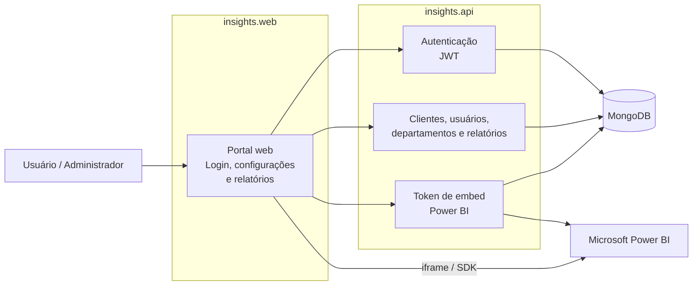

# Insights Platform

[](https://nx.dev/)
[](https://nextjs.org/)
[](https://react.dev/)
[](https://redux-toolkit.js.org/)
[](https://www.typescriptlang.org/)
[](https://tailwindcss.com/)
[](https://www.serverless.com/)
[](https://aws.amazon.com/lambda/)
[](https://www.mongodb.com/)
[](https://powerbi.microsoft.com/)
[]()

Plataforma SaaS white-label para disponibilizar relatórios **Microsoft Power BI** em um portal web com controle por tenant, clientes, departamentos, usuários e permissões.

Tecnicamente, é um monorepo **Nx** com:

- **`insights.web`**: frontend Next.js 13 + React 18.
- **`insights.api`**: API Serverless em TypeScript para AWS Lambda / Serverless Offline.
- **MongoDB**: persistência local e multi-tenant.
- **Power BI / Azure AD**: integração para embed real de relatórios quando credenciais Microsoft estão configuradas.

**Repositório:** [github.com/reluviari/insights-platform](https://github.com/reluviari/insights-platform)

---

## Visão geral do produto

A Insights Platform permite que uma empresa entregue relatórios Power BI para diferentes clientes e departamentos, mantendo isolamento de dados por tenant.

| Área | O que entrega |
|------|---------------|
| Portal web | Login, navegação autenticada e visualização de relatórios. |
| Administração | Gestão de clientes, usuários, departamentos, relatórios e permissões. |
| Multi-tenant | Cada tenant tem seus próprios clientes, usuários e relatórios autorizados. |
| Power BI embed | Relatórios incorporados no navegador com tokens emitidos pela API. |
| Desenvolvimento local | Stack completa com Docker: MongoDB, API e Web. |

Documento canônico de produto: [docs/PRODUCT_SCOPE.md](docs/PRODUCT_SCOPE.md).

---

## Demo e ambientes

Este repositório **não define uma URL pública fixa de produção ou demo**. Domínios, API Gateway, secrets Microsoft e infraestrutura AWS dependem do pipeline de deploy da organização.

Para experimentar o produto, use o ambiente local:

| Serviço | URL local |
|---------|-----------|
| Frontend Next.js | [http://localhost:3000](http://localhost:3000) |
| API Serverless Offline | [http://localhost:4001](http://localhost:4001) |
| Health check | `GET http://localhost:4001/api/health-check` |
| MongoDB | `mongodb://localhost:27017` |

---

## Funcionalidades principais

| Funcionalidade | Status no projeto |
|----------------|-------------------|
| Login com e-mail e senha | Implementado via API + JWT. |
| Usuário administrador | Seed local cria `admin@example.com`. |
| Usuário final | Seed local cria `dev@example.com`. |
| Gestão de clientes | Módulo backend e telas administrativas. |
| Gestão de usuários | Módulo backend e telas administrativas. |
| Gestão de departamentos | Módulo backend e telas administrativas. |
| Gestão de relatórios | Módulo backend para relatórios, páginas e associações. |
| Filtros / target filters | Módulos para filtros e segmentação de relatórios. |
| Embed Power BI | Fluxo via API; embed real exige Azure + Power BI configurados. |
| Keycloak / SSO | Preparação versionada, mas **não ativo** no fluxo atual. |

---

## Como rodar localmente

### Pré-requisitos

- Docker e Docker Compose.
- Conta Microsoft / Azure / Power BI somente se for testar embed real com tokens válidos.

Sem Docker, cada app pode rodar isoladamente com Node.js, mas o caminho recomendado para primeira execução é a stack completa abaixo.

### Stack completa com Docker

Na raiz do clone (`insights-platform`):

```bash
cp .env.docker.example .env
docker compose up --build
```

O Compose sobe:

1. MongoDB.
2. Seed de desenvolvimento.
3. API em Serverless Offline.
4. Frontend Next.js.

Quando os containers estiverem prontos, abra [http://localhost:3000/login](http://localhost:3000/login).

### Credenciais de desenvolvimento

Credenciais apenas para ambiente local com seed aplicado:

| Persona | E-mail | Senha |
|---------|--------|-------|
| Administrador da plataforma / tenant | `admin@example.com` | `DevPass123!` |
| Usuário final | `dev@example.com` | `DevPass123!` |

O administrador deve ver áreas de **Configurações**. O usuário final valida o fluxo de consumo de relatórios.

### Verificação rápida

```bash
curl -s http://localhost:4001/api/health-check
```

Teste de login via API:

```bash
curl -sS -X POST http://localhost:4001/api/auth/sign-in \
  -H "Content-Type: application/json" \
  -H "Origin: http://localhost:3000" \
  -d '{"email":"admin@example.com","password":"DevPass123!"}'
```

Em sucesso, a resposta inclui `accessToken`.

Detalhes de seed, hot reload, troubleshooting e execução sem Docker: [docs/LOCAL_DEVELOPMENT.md](docs/LOCAL_DEVELOPMENT.md).

---

## Diagrama de arquitetura simplificado



Para diagramas técnicos detalhados de AWS, Docker Compose, Lambdas e sequência de embed: [docs/ARCHITECTURE.md](docs/ARCHITECTURE.md).

---

## Como funciona o Power BI embed

Fluxo resumido:

1. O usuário acessa uma página de relatório no front.
2. O front chama a API pedindo dados de embed.
3. A API valida usuário, tenant, relatório e permissões.
4. A API obtém token no Azure AD e chama a API REST do Power BI.
5. O front renderiza o relatório com `powerbi-client-react`.

Sem credenciais Azure / Power BI reais, a aplicação local ainda sobe e permite testar login, navegação e administração. Fluxos de embed real podem falhar por falta de configuração externa, e isso é esperado.

Detalhes: [docs/POWER_BI.md](docs/POWER_BI.md).

---

## Autenticação, tenant e SSO

| Tema | Resumo |
|------|--------|
| Login atual | E-mail + senha contra MongoDB. |
| Sessão | JWT emitido pela API. |
| Tenant | Identificado pelo `Origin` / `urlSlug` e validado na API. |
| Autorização | Roles e vínculo do usuário com tenant, customer, departamentos e relatórios. |
| Keycloak | Não usado no fluxo diário; material versionado para SSO futuro. |

Detalhes de `Origin`, `urlSlug`, roles, JWT e isolamento multi-tenant: [docs/AUTH_AND_TENANCY.md](docs/AUTH_AND_TENANCY.md).

SSO futuro / Keycloak: [docker/KEYCLOAK.md](docker/KEYCLOAK.md).

---

## Scripts úteis

| Comando | Onde executar | Descrição |
|---------|----------------|-----------|
| `docker compose up --build` | Raiz | Stack local completa: Mongo + API + Web. |
| `npm run dev:api` | Raiz | Target Nx para API. |
| `npm run dev:web` | Raiz | Target Nx para Web. |
| `npm run test:api` | Raiz | Testes da API via Nx. |
| `npm run lint:api` | Raiz | Lint da API via Nx. |
| `npm run lint:web` | Raiz | Lint do Web via Nx. |
| `npm run lint` | Raiz | Lint em todos os projetos com target. |
| `npm run test` | Raiz | Testes em todos os projetos com target. |
| `npm run many:build` | Raiz | Build dos projetos com target. |
| `npm run seed:mongo:dev` | Raiz | Seed completo no Mongo local. |
| `npm run dev` | `insights.api` | API Serverless Offline. |
| `npm run build` | `insights.api` | Build TypeScript da API. |
| `npm test` | `insights.api` | Testes Jest da API. |
| `yarn dev` | `insights.web` | Frontend Next.js em desenvolvimento. |
| `yarn build` | `insights.web` | Build de produção do front. |
| `yarn lint` | `insights.web` | Lint do front. |
| `npx nx graph` | Raiz | Grafo de dependências Nx. |
| `npx nx affected -t lint,test,build` | Raiz | Executa targets apenas nos projetos afetados. |

Os arquivos `project.json` de cada app são a fonte de verdade dos targets Nx expostos na raiz.

---

## Endpoints principais da API

Todas as rotas HTTP usam o prefixo `/api` em Serverless Offline na porta 4001.

| Método | Rota | Auth típica | Descrição |
|--------|------|-------------|-----------|
| GET | `/api/health-check` | Não | Verificação operacional básica. |
| POST | `/api/auth/sign-in` | Não | Login clássico com e-mail e senha. |
| POST | `/api/auth/send-define-password` | Não | Envio de fluxo para definir / redefinir senha. |
| POST | `/api/auth/define-password` | Não | Definição de senha com token. |
| POST | `/api/auth/validate-token` | Varia | Validação de JWT. |
| Várias | `/api/reports/...` | Sim | Relatórios, páginas e sincronização Power BI. |
| Várias | `/api/embed-token/...` | Sim | Dados e token para embed. |
| Várias | `/api/customer/...` | Sim | Gestão de clientes. |
| Várias | `/api/user/...` | Sim | Gestão de usuários. |
| Várias | `/api/department/...` | Sim | Gestão de departamentos. |
| Várias | `/api/target-filter/...` | Sim | Gestão de filtros de destino. |

A lista completa está em `insights.api/serverless.yml` e `insights.api/src/modules/**/functions/*.yml`.

---

## Stack

### Frontend (`insights.web`)

| Tecnologia | Uso |
|------------|-----|
| Next.js 13 | Framework e rotas em `src/pages`. |
| React 18 | Interface. |
| Redux Toolkit + RTK Query | Estado global e chamadas HTTP. |
| Tailwind CSS + SASS | Estilos. |
| powerbi-client-react | Incorporação de relatórios no browser. |
| NextAuth.js | Camada de sessão (`NEXTAUTH_*`). |
| TypeScript | Tipagem. |

### Backend (`insights.api`)

| Tecnologia | Uso |
|------------|-----|
| Serverless Framework 3 | Lambda + API Gateway + estágios. |
| Node.js 16.x | Runtime AWS declarado. |
| TypeScript | Linguagem fonte dos handlers. |
| MongoDB + Mongoose | Persistência multi-tenant. |
| Middy | Middleware HTTP nas funções. |
| Axios | Cliente HTTP para Azure AD / Power BI REST. |
| class-validator / class-transformer | DTOs nas fronteiras HTTP. |
| Jest | Testes automatizados. |

### Monorepo, Docker e Nx

| Item | Função |
|------|--------|
| `package.json` | Workspaces para `insights.api` e `insights.web`. |
| `nx.json` | Cache, grafo e base para `nx affected`. |
| `insights.*/project.json` | Targets por app. |
| `docker-compose.yml` | Stack local Mongo + API + Web. |
| `.env.docker.example` | Contrato de variáveis para Compose. |

O Nx dá visibilidade cruzada ao monorepo sem obrigar deploy acoplado: mudanças no front não precisam rebuild da API e vice-versa, desde que os contratos REST permaneçam compatíveis.

---

## Estrutura de pastas

```text
insights-platform/
├── docker-compose.yml          # Stack Mongo + API + Web em dev
├── .env.docker.example
├── nx.json
├── package.json
├── docs/
│   ├── PRODUCT_SCOPE.md
│   ├── ARCHITECTURE.md
│   ├── LOCAL_DEVELOPMENT.md
│   ├── AUTH_AND_TENANCY.md
│   ├── POWER_BI.md
│   ├── ai-workflow.md
│   ├── insights-platform-agents-setup.md
│   └── git-github.md
├── docker/
│   ├── KEYCLOAK.md
│   ├── keycloak/import/
│   └── mongo/seed-insights-keycloak-dev.js
├── insights.api/
│   ├── README.md
│   ├── serverless.yml
│   ├── config/
│   ├── Dockerfile.dev
│   ├── project.json
│   └── src/modules/
├── insights.web/
│   ├── README.md
│   ├── Dockerfile.dev
│   ├── project.json
│   └── src/
├── .cursor/rules/
└── README.md
```

---

## Testes e qualidade

| Camada | Onde | Comando |
|--------|------|---------|
| API | `insights.api` | `npm test`, `npm run test-coverage`, `npm run lint` |
| Frontend | `insights.web` | `yarn lint` |
| Monorepo | Raiz | `npm run lint`, `npm run test`, `npx nx affected -t lint,test,build` |

Não há neste README uma suíte E2E browser documentada como comando único na raiz. Fluxos manuais recomendados passam por login em `localhost:3000`, navegação nas áreas autenticadas e chamadas à API observadas nas DevTools.

---

## Integração contínua (CI)

A estratégia recomendada para CI é manter pipelines separados por app, com filtros por caminho para evitar rodar jobs desnecessários quando apenas uma parte do monorepo mudou:

| Workflow sugerido | Gatilho esperado |
|----------|------------------|
| CI API | Alterações em `insights.api/**` e arquivos compartilhados. |
| CI Web | Alterações em `insights.web/**` e arquivos compartilhados. |

Quando os workflows forem versionados, eles devem executar os targets relevantes (`lint`, `test`, `build`) conforme maturidade do projeto. Se existirem workflows legados dentro de `insights.api/.github/` ou `insights.web/.github/`, o objetivo é centralizar na raiz ou documentar claramente o que permanece ativo.

---

## Observabilidade

| Recurso | Uso atual |
|---------|-----------|
| Health check | `GET /api/health-check`. |
| Logs | API deve usar logger do projeto e não registrar tokens, senhas ou PII. |
| Power BI / Azure | Erros de embed/token devem retornar erros de negócio ou HTTP sem expor secrets. |

Estratégias como Prometheus centralizado, tracing distribuído e dashboards CloudWatch são roadmap de operações por ambiente.

---

## Desenvolvimento assistido por IA

Este repositório foi estruturado para trabalhar com assistentes de código como colaboradores disciplinados.

| Documento | Quando usar |
|-----------|-------------|
| [docs/PRODUCT_SCOPE.md](docs/PRODUCT_SCOPE.md) | Produto, tenants, Power BI e critérios de aceite. |
| [docs/ai-workflow.md](docs/ai-workflow.md) | Disciplina de fases com IA. |
| [docs/insights-platform-agents-setup.md](docs/insights-platform-agents-setup.md) | Papéis dos agentes / subagentes. |
| [docs/git-github.md](docs/git-github.md) | Git monorepo, hooks e convenções. |
| `.cursor/rules/` | Regras persistentes para assistentes de código. |

Fluxo recomendado:

1. Planejar antes de implementar mudanças grandes.
2. Dividir tarefas por papel quando houver front, back, infra e revisão.
3. Usar regras persistentes do repositório.
4. Revisar contra escopo, segurança e contratos REST antes de encerrar.

---

## Documentação complementar

| Documento | Conteúdo |
|-----------|----------|
| [insights.api/README.md](insights.api/README.md) | Guia específico da API. |
| [insights.web/README.md](insights.web/README.md) | Guia específico do frontend. |
| [docs/ARCHITECTURE.md](docs/ARCHITECTURE.md) | Arquitetura técnica, AWS, Docker e diagramas detalhados. |
| [docs/LOCAL_DEVELOPMENT.md](docs/LOCAL_DEVELOPMENT.md) | Execução local, seed, hot reload e troubleshooting. |
| [docs/AUTH_AND_TENANCY.md](docs/AUTH_AND_TENANCY.md) | Login, JWT, Origin, tenant e isolamento. |
| [docs/POWER_BI.md](docs/POWER_BI.md) | Azure AD, Power BI REST e embed. |
| [docker/KEYCLOAK.md](docker/KEYCLOAK.md) | Material para SSO futuro com Keycloak. |
