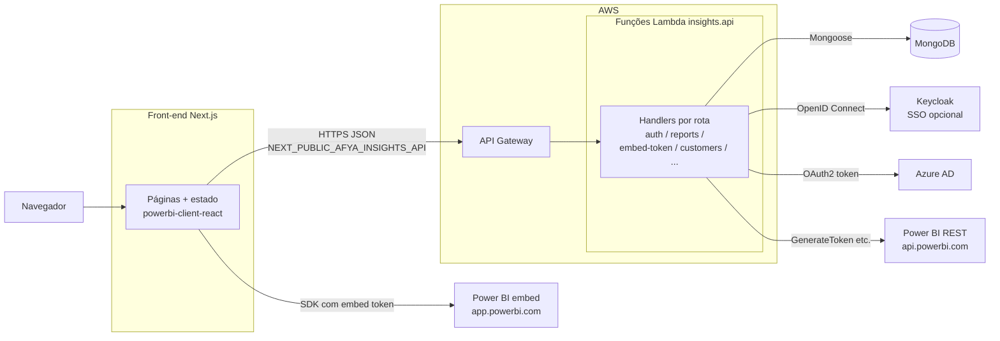
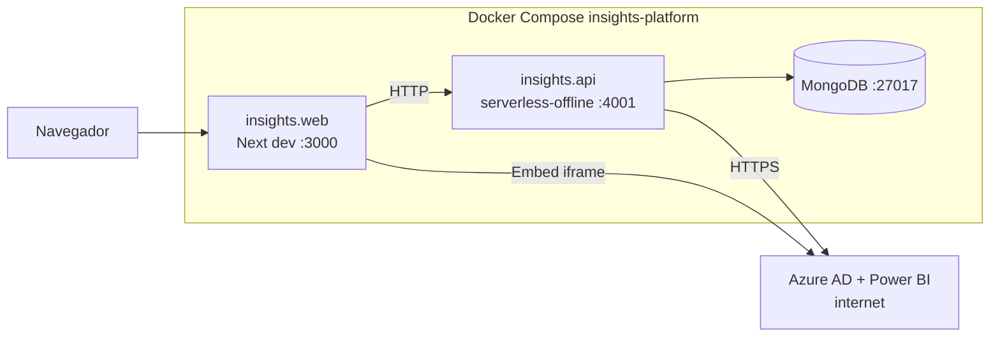
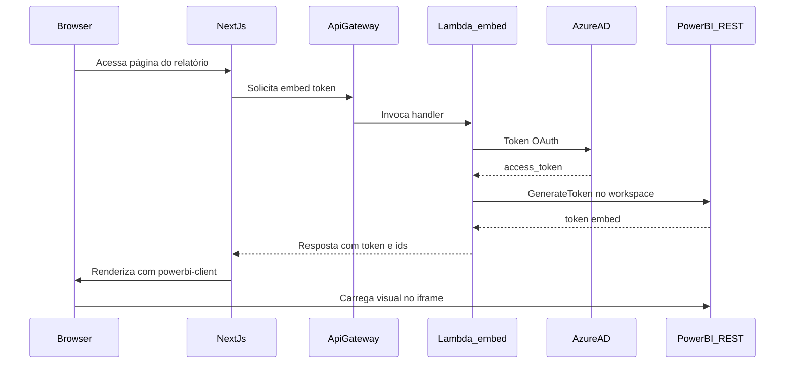

# Insights Platform

Monorepo do produto **Insights Platform** (pasta do repositório: `insights-platform`), com **interface Next.js** (`insights.web`), **API serverless TypeScript** (`insights.api`, AWS Lambda via Serverless Framework), multi-tenant, **MongoDB**, **Azure AD** e integração **Microsoft Power BI** (embed).

## Ambiente de produção / demo

Não há URLs públicas de demo fixas neste repositório: **front e API em produção dependem do deploy da sua organização** (AWS, domínio do tenant, credenciais Microsoft). Para testar localmente, use a seção [Como rodar](#como-rodar).

## Diagrama de arquitetura

### Como a API, as Lambdas e o Power BI se conectam

Em **produção (AWS)** não existe um servidor Node separado que “chama uma Lambda”: o que o navegador chama é o **API Gateway**, e cada rota dispara o **handler TypeScript** já empacotado como **função Lambda**. Ou seja, **a Lambda é a API** nesse modelo.

Para **incorporar relatórios**, o fluxo típico é:

1. O **front-end** pede um token de embed à sua API (Lambda de `embed-token` ou rota equivalente).
2. Essa Lambda obtém um **access token** no **Azure AD** (credenciais de aplicação/usuário em variáveis de ambiente).
3. Com esse token, a Lambda chama a **API REST do Power BI** (`api.powerbi.com`, por exemplo `GenerateToken`).
4. O **Next.js** usa o token devolvido com **powerbi-client(-react)** no navegador; o iframe final fala com **app.powerbi.com**.

Em **desenvolvimento local**, o **Serverless Offline** simula API Gateway + invocação de Lambda (porta **4001** no `docker compose` deste repositório).

### Visão geral — produção (AWS + serviços externos)



### Stack local com Docker Compose (monorepo)



### Sequência — obter token de embed e exibir relatório



> Versão com **módulos internos**: [insights.api/README.md](insights.api/README.md#arquitetura) · [insights.web/README.md](insights.web/README.md#arquitetura) · Keycloak local: [docker/KEYCLOAK.md](docker/KEYCLOAK.md)

---

## Pré-requisitos

- [Docker](https://docs.docker.com/get-docker/) e Docker Compose (ex.: Docker Desktop), para a stack recomendada
- **Sem Docker:** Node.js **16+** em `insights.api`, **20+** em `insights.web`, **Yarn 1.x** no front (há `yarn.lock`), **MongoDB** acessível (ex.: porta `27017`)
- Conta **Microsoft** com **Azure AD** + **Power BI** configurados **se** for testar embed e tokens reais (credenciais via `.env`)

## Como rodar

### Stack completa (recomendado)

Na **raiz** do repositório (`insights-platform`):

```bash
cp .env.docker.example .env
```

Edite o `.env` com segredos **Azure** / **Keycloak** quando necessário (sem Azure, a stack sobe; embed pode falhar).

```bash
docker compose up --build
```

Aguarde subir **MongoDB**, **API** e **Web**. Keycloak opcional: `docker compose --profile keycloak up --build` e `KEYCLOAK_URL=http://keycloak:8080` no `.env`.

| Serviço        | URL |
|----------------|-----|
| Frontend       | [http://localhost:3000](http://localhost:3000) |
| API (offline)  | [http://localhost:4001](http://localhost:4001) |
| MongoDB (host) | `localhost:27017` |
| Keycloak (profile) | [http://localhost:8080](http://localhost:8080) |

### Apps isolados

Cada pasta pode rodar sozinha (front **precisa** da API em algum lugar):

```bash
cd insights.api && docker compose up -d
cd insights.api && npm install && npm run dev

cd insights.web && cp .env.example .env && yarn install && yarn dev
```

Detalhes: [insights.api/README.md](insights.api/README.md) · [insights.web/README.md](insights.web/README.md)

### Verificar que está rodando

```bash
curl -s http://localhost:4001/api/health-check
```

Resposta esperada: JSON de health do serviço (sem autenticação nesta rota).

## Credenciais e dados de teste

| Item | Observação |
|------|------------|
| **Usuários / tenants** | Não há **seed** ou credenciais padrão versionadas; dependem de dados no **MongoDB** e, se usado, de **Keycloak** (realm alinhado a `tenants.realmId`). |
| **Azure / Power BI** | **Client ID**, **secret**, **tenant** e usuário/senha (ou fluxo definido no projeto) entram no `.env` ou em `config/local.yml` via variáveis de ambiente — veja [.env.docker.example](.env.docker.example). |
| **NextAuth** | Em dev, defina `NEXTAUTH_SECRET` no `.env` (exemplo no `.env.docker.example`). |

## Modo de desenvolvimento

Para hot reload **sem** rebuild de imagem a cada mudança:

1. Suba só o Mongo (`insights.api/docker-compose.yml` ou stack completa).
2. Terminal 1: `cd insights.api && npm run dev` (Serverless Offline, `:4001`).
3. Terminal 2: `cd insights.web && yarn dev` (`:3000`).

Alternativa avançada na API: `npm run dev:local` (Fastify na porta **45000** — ver [insights.api/README.md](insights.api/README.md)).

## Scripts disponíveis

| Comando | Onde | Descrição |
|---------|------|-----------|
| `npm run dev` | `insights.api` | Serverless Offline (simula API Gateway + Lambdas) |
| `npm run dev:local` | `insights.api` | Fastify local + rota `POST /lambda` (subconjunto de rotas) |
| `npm run build` | `insights.api` | `tsc` |
| `npm test` | `insights.api` | Jest |
| `npm run test-coverage` | `insights.api` | Jest com cobertura |
| `npm run lint` | `insights.api` | ESLint em `src/**` |
| `yarn dev` | `insights.web` | Next.js dev server |
| `yarn build` | `insights.web` | Build de produção |
| `yarn start` | `insights.web` | Servidor Next após build |
| `yarn lint` | `insights.web` | `next lint` |

## Monorepo Nx (raiz)

A raiz possui **`package.json`** com **npm workspaces** (`insights.api`, `insights.web`) e **[Nx](https://nx.dev/)** para orquestrar tarefas, **cache** e **`nx affected`** (comparando com `main` — veja `defaultBase` em [nx.json](nx.json)).

**Pré-requisito na raiz:** Node.js **18+** (recomendado **20**) e `npm install` uma vez.

| Comando na raiz | Descrição |
|-----------------|-----------|
| `npx nx graph` | Grafo de projetos |
| `npx nx run insights-api:dev` | Sobe Serverless Offline (delega a `npm run dev` na API) |
| `npx nx run insights-web:dev` | Sobe Next dev (via `yarn dev` no front) |
| `npx nx run-many -t lint --all` | Lint em todos os projetos com target `lint` |
| `npx nx affected -t lint,test,build` | Só projetos afetados pelo diff (útil no CI) |
| `npx nx run insights-api:package-serverless` | `serverless package` na API (artefato de deploy) |

Projetos e targets estão em [insights.api/project.json](insights.api/project.json) e [insights.web/project.json](insights.web/project.json).

CI com **filtros por pasta** (só API ou só Web): [.github/workflows/](.github/workflows/).

Fluxo de trabalho com assistência de AI: [docs/ai-workflow.md](docs/ai-workflow.md) · Agentes (Cursor): [docs/insights-platform-agents-setup.md](docs/insights-platform-agents-setup.md).

**Unificar Git em um único repositório** (hoje pode haver `.git` só dentro de `insights.api` / `insights.web`): [docs/git-github.md](docs/git-github.md).

## Endpoints da API (exemplos)

Rotas reais seguem o `serverless.yml` (prefixo **`/api`** com Serverless Offline). Exemplos:

| Método | Rota | Auth | Descrição |
|--------|------|------|-----------|
| GET | `/api/health-check` | Não | Saúde do serviço |
| POST | `/api/auth/sign-in` | Não | Login (fluxo depende de corpo e tenant) |
| — | `/api/reports/...` | Em geral sim | Relatórios, páginas, sincronização Power BI |
| — | `/api/embed-token/...` | Em geral sim | Token de embed (Azure → Power BI) |

Lista completa: painel do Serverless Offline ao subir `npm run dev` ou inspeção de `insights.api/serverless.yml` e `src/modules/**/functions/*.yml`.

## Escopo funcional

Especificação de produto (visão, personas, fora de escopo, critérios de aceite): **[docs/PRODUCT_SCOPE.md](docs/PRODUCT_SCOPE.md)**.

Em resumo:

- **Multi-tenant (SaaS):** tenant → clientes → departamentos → usuários → relatórios.
- **Autenticação:** JWT; **Keycloak** opcional para SSO corporativo.
- **Administração:** clientes, usuários, departamentos, vínculo de relatórios.
- **Power BI:** embed com token seguro, sincronização e filtros (`report-filter`, `target-filter`, etc.).
- **Plataforma BI white-label:** dashboards embebidos, permissões por contexto organizacional.

## Stack

### Frontend (`insights.web`)

| Tecnologia | Uso |
|------------|-----|
| Next.js 13 | App router / páginas, SSR onde aplicável |
| React 18 | UI |
| Redux Toolkit + RTK Query | Estado e dados remotos |
| Tailwind CSS + SASS | Estilo |
| powerbi-client-react | Embed de relatórios no browser |
| TypeScript | Tipagem |

### Backend (`insights.api`)

| Tecnologia | Uso |
|------------|-----|
| Serverless Framework 3 | Deploy AWS Lambda + API Gateway |
| Node.js 16.x | Runtime declarado no `serverless.yml` |
| TypeScript | Código-fonte |
| MongoDB + Mongoose | Persistência |
| Middy | Middlewares HTTP nas Lambdas |
| Axios | Chamadas Azure / Power BI |
| Jest | Testes |

### Monorepo e infraestrutura local

| Item | Uso |
|------|-----|
| `docker-compose.yml` (raiz) | Mongo + API + Web (dev) |
| `package.json` / `nx.json` (raiz) | Workspaces npm + Nx |
| `insights.api/project.json`, `insights.web/project.json` | Targets Nx por app |
| `.env.docker.example` | Modelo de variáveis para Compose |
| `docker/KEYCLOAK.md` | SSO local opcional |

## Estrutura de pastas

```
insights-platform/
├── package.json
├── package-lock.json
├── nx.json
├── docker-compose.yml
├── .env.docker.example
├── docs/
│   ├── PRODUCT_SCOPE.md
│   ├── ai-workflow.md
│   ├── insights-platform-agents-setup.md
│   └── git-github.md
├── .cursor/
│   └── rules/
├── docker/
│   └── KEYCLOAK.md
├── insights.api/
│   ├── project.json
│   ├── serverless.yml
│   ├── config/
│   ├── src/modules/
│   │   ├── auth/
│   │   ├── customer/
│   │   ├── department/
│   │   ├── embed-token/
│   │   ├── report/
│   │   ├── report-filter/
│   │   ├── target-filter/
│   │   ├── user/
│   │   ├── tenant/
│   │   ├── settings/
│   │   └── health-check/
│   ├── Dockerfile.dev
│   └── README.md
├── insights.web/
│   ├── project.json
│   ├── src/pages/
│   ├── src/components/
│   ├── src/services/
│   ├── src/store/
│   ├── public/
│   ├── Dockerfile.dev
│   └── README.md
└── README.md
```

(Ajuste fino de pastas do Next conforme o que existir em `insights.web/src` ou `app/` — o importante é localizar cada app.)

## Testes

| Tipo | Onde | Comando |
|------|------|---------|
| Unitários / integração API | `insights.api` | `npm test` · `npm run test-coverage` |
| Lint API | `insights.api` | `npm run lint` |
| Lint Web | `insights.web` | `yarn lint` |

Não há suíte E2E browser documentada na raiz; fluxos manuais via front em `localhost:3000`.

## Integração contínua (CI)

### Workflows na raiz (Nx + filtros por app)

Em [.github/workflows/](.github/workflows/):

- **`ci-api.yml`** — dispara em mudanças em `insights.api/**` (e arquivos Nx na raiz); roda `nx affected` / targets da API quando aplicável.
- **`ci-web.yml`** — dispara em mudanças em `insights.web/**`; roda lint/build do front.

Ajuste `branches` e versões de Node conforme a política da equipe.

### Workflows legados dentro dos apps

Podem ainda existir:

- `insights.api/.github/workflows/` — ex.: *jira issue required*
- `insights.web/.github/workflows/` — *security*, *jira issue required*

Unifique ou desative duplicados após validar o CI da raiz.

## Variáveis de ambiente (referência rápida)

| Onde | Arquivo / uso |
|------|----------------|
| Stack Docker na raiz | Copiar [.env.docker.example](.env.docker.example) → `.env` na raiz |
| API local / Lambda env | [insights.api/config/local.yml](insights.api/config/local.yml) + overrides `${env:...}` |
| Front | [insights.web/.env.example](insights.web/.env.example) |

---

## Contexto para a IA no Cursor (nova sessão ou após reabrir)

Não há um comando que “carregue todo o projeto” de uma vez na memória da IA. O que **persiste no repositório** é o que o time versiona; o Cursor usa isso assim:

| Mecanismo | O que faz |
|-----------|------------|
| **`.cursor/rules/*.mdc`** | Regras do projeto (várias com `alwaysApply: true`). Ao **abrir a pasta `insights-platform`** de novo, essas regras voltam a orientar o agente. |
| **`docs/*.md` e READMEs** | **Não** entram inteiros em toda mensagem automaticamente. Para a primeira mensagem de uma conversa importante, use **@** (mention de arquivo) na caixa do Chat / Composer. |
| **Git** | `git commit` / `git push` garantem que outra máquina ou outra sessão tenha os mesmos arquivos — não “alimenta” a IA sozinho, mas mantém o contexto do time. |

### Recomendação: usar `@` na primeira mensagem

Quando começar um tópico novo ou depois de **fechar e abrir** o Cursor, anexe os documentos principais com **`@`** (se a sua build do Cursor mostrar esses arquivos na busca):

| Arquivo | Para quê |
|---------|----------|
| `@docs/PRODUCT_SCOPE.md` | Visão de produto, escopo, multi-tenant, Power BI |
| `@docs/ai-workflow.md` | Fluxo disciplinado com IA |
| `@docs/insights-platform-agents-setup.md` | Papéis dos agentes (orquestrador, front, back, DevOps, revisor) |
| `@README.md` | Visão geral do monorepo e como rodar |

Opcional: `@insights.api/README.md` ou `@insights.web/README.md` se a tarefa for só em um app.

Regras adicionais **globais** (válidas em qualquer projeto): **Cursor → Settings → Cursor Settings → Rules** (ou equivalente na sua versão).

---

## Desenvolvimento assistido por IA

Este repositório foi estruturado para uso do **[Cursor](https://cursor.com)** (e ferramentas similares) como **colaborador disciplinado**, não como gerador automático de código sem critério.

### Como usar na prática

1. **Planejar antes de codar** — ler [docs/PRODUCT_SCOPE.md](docs/PRODUCT_SCOPE.md), READMEs e, se aplicável, o escopo da tarefa; propor o plano mínimo antes de mudanças grandes.
2. **Agentes com papéis definidos** — orquestração, implementação front, implementação back, workspace/DevOps e revisão de escopo estão descritos em [docs/insights-platform-agents-setup.md](docs/insights-platform-agents-setup.md).
3. **Regras persistentes** — o comportamento esperado da IA está em [`.cursor/rules/`](.cursor/rules/): arquitetura, monorepo Nx, API serverless, front Next, operação, testes e fluxo de trabalho.
4. **Revisão antes de fechar uma fase** — conferir aderência ao escopo, às regras e a riscos (tenant, Azure/Power BI, segredos), conforme [docs/ai-workflow.md](docs/ai-workflow.md).

Mais detalhes do fluxo: [docs/ai-workflow.md](docs/ai-workflow.md).

---

## Visão geral de negócio (complementar)

### Propósito

Plataforma de **BI white-label** que permite oferecer dashboards **Power BI** como serviço, com **gestão multi-cliente**, **departamentos**, **usuários** e **controle de acesso**.

### Modelo e hierarquia

```
Tenant → Customers → Departments → Users → Reports
```

### Proposta de valor

- **Fornecedor:** monetização de BI como produto SaaS, operação centralizada.
- **Cliente final:** analytics sem montar infraestrutura própria.
- **Técnico:** escalabilidade serverless na AWS + ecossistema Microsoft (Power BI + Azure).

Para **produtos e QA** testando só o ambiente local, priorize as seções [Como rodar](#como-rodar) e os READMEs por app acima.

