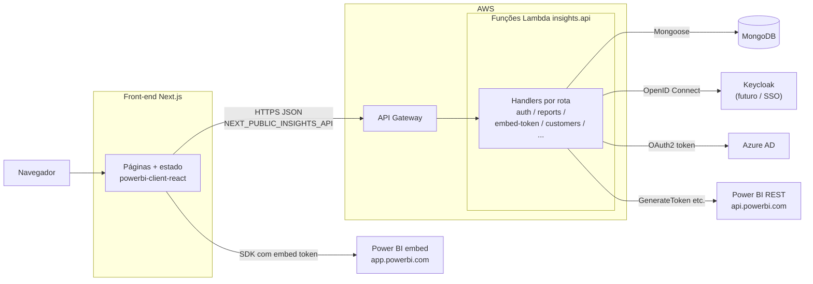
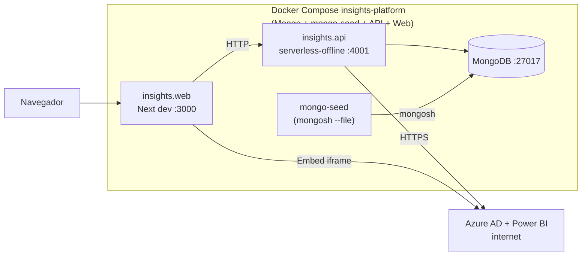
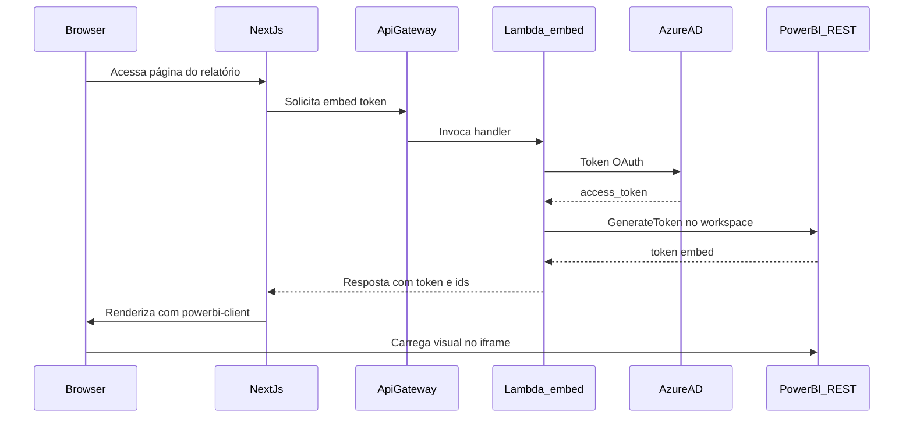

# Insights Platform

Monorepo orientado por **[Nx](https://nx.dev/)** com **`insights.web`** (Next.js 13, React 18, Redux Toolkit, Tailwind, embed Power BI no cliente) e **`insights.api`** (Serverless Framework 3, handlers AWS Lambda em TypeScript, MongoDB com Mongoose). O produto é uma **plataforma SaaS multi-tenant** de BI white-label com relatórios **Microsoft Power BI** incorporados na web, gestão de clientes, departamentos e utilizadores, e integrações **Azure AD** para tokens de serviço / utilizador junto da API do Power BI.

Em **produção**, o runtime típico é **API Gateway + Lambda** na AWS; em **desenvolvimento local**, **Docker Compose** na raiz sobe MongoDB, a API em **Serverless Offline** e o Next.js, para fluxos próximos do ambiente real sem publicar na nuvem.

**Repositório:** [github.com/reluviari/insights-platform](https://github.com/reluviari/insights-platform)

---

## Demo e ambientes

Contrariamente a projetos com demo pública fixa (por exemplo um frontend na Vercel e uma API no Render), **este repositório não define URLs de produção ou demo partilhadas**. O que existe na sua organização (domínio do tenant, API Gateway, variáveis Microsoft, secrets AWS) depende exclusivamente do **seu** pipeline de deploy.

Para explorar o produto sem esse deploy, o caminho suportado pelo repositório é **desenvolvimento local** com Docker e os dados de seed descritos neste README — em especial a secção [Credenciais padrão e como fazer login](#credenciais-padrão-e-como-fazer-login-desenvolvimento-local).

---

## Diagrama de arquitetura

### Como a API, as Lambdas e o Power BI se conectam

Em **produção (AWS)** não existe um servidor Node “long-running” que invoque Lambdas manualmente: o navegador (ou integração) fala com o **API Gateway**, que por sua vez **invoca o handler** da Lambda já empacotado para cada rota. Ou seja, **cada rota HTTP relevante é atendida por código TypeScript empacotado como função Lambda**.

Para **incorporar relatórios Power BI**, o fluxo típico é:

1. O **front-end** pede à sua API um token ou pacote de embed (`embed-token` ou rotas equivalentes).
2. A Lambda correspondente obtém um **access token** no **Azure AD**, usando credenciais de aplicação ou utilizador configuradas em variáveis de ambiente / cofre — **nunca** hardcoded no repositório.
3. Com esse token, a Lambda chama a **REST API do Power BI** (`api.powerbi.com`), por exemplo rotas de **GenerateToken** ou equivalentes para o recurso em causa.
4. O **Next.js** utiliza o SDK **`powerbi-client`** / **`powerbi-client-react`** no browser com os dados devolvidos pela API; o iframe ou componente final comunica com **`app.powerbi.com`** conforme o modelo de embed.

Em **desenvolvimento local**, o plugin **serverless-offline** expõe as mesmas rotas sobre HTTP (porta **4001** no `docker-compose.yml` deste monorepo), mantendo o prefixo **`/api`** configurado no Serverless.

### Visão geral — produção (AWS + serviços externos)



### Stack local com Docker Compose (monorepo)



_Keycloak **não está em uso neste momento** — existe apenas preparação no repositório (perfil Compose `keycloak`, `docker/keycloak/import`, documentação em [docker/KEYCLOAK.md](docker/KEYCLOAK.md)) para uma eventual fase futura de SSO corporativo._

### Sequência — obter token de embed e exibir relatório



> Versão com **módulos internos** por app: [insights.api/README.md](insights.api/README.md#arquitetura) · [insights.web/README.md](insights.web/README.md#arquitetura).  
> **SSO / Keycloak (apenas futuro):** [docker/KEYCLOAK.md](docker/KEYCLOAK.md).

---

## Pré-requisitos

- **Docker** e **Docker Compose** (recomendado para alinhar Mongo + API + Web sem instalar Node globalmente na mesma versão em todas as máquinas).
- **Sem Docker na máquina:**
  - **Node.js 16+** para trabalhar dentro de `insights.api` (runtime declarado no `serverless.yml`).
  - **Node.js 20+** para `insights.web` (alinhado ao `Dockerfile.dev` do front).
  - **Yarn 1.x** no front — o repositório inclui `yarn.lock`; também pode usar `npm` localmente, mas os exemplos oficiais do front assumem Yarn onde aplicável.
  - **MongoDB** acessível (por exemplo `localhost:27017`) quando não usar o contentor deste Compose.
- **Conta Microsoft com Azure AD e ambiente Power BI** apenas quando precisar de **embed real**, sincronização com workspaces ou tokens válidos na nuvem — caso contrário a stack local continua útil para UI, auth contra Mongo e navegação; fluxos que chamam a Graph/API Power BI podem falhar **sem isso ser um bug**: falta configuração de segredos.

---

## Como rodar

### Stack completa (recomendado)

Na **raiz** do clone (`insights-platform`):

```bash
cp .env.docker.example .env
docker compose up --build
```

Aguarde o Compose construir as imagens de desenvolvimento da API e do Web (primeira vez é mais lenta por causa de `npm ci` / `yarn install` dentro do Dockerfile). O **MongoDB** expõe healthcheck interno; quando está **healthy**, corre o contentor **one-shot `mongo-seed`** (`mongosh` com o mesmo script JS); quando termina com sucesso, a **API** arranca e o **Web** depende da API.

**Seed dos dados de desenvolvimento**

Em **cada** `docker compose up`, o serviço **`mongo-seed`** executa [`docker/mongo/seed-insights-keycloak-dev.js`](docker/mongo/seed-insights-keycloak-dev.js) contra `MONGODB_URI` (por defeito `mongodb://mongo:27017/qa-pbi`). O script é **idempotente** (`updateOne` / `replaceOne` com upsert) — garante tenant, customer e dois utilizadores com hash bcrypt de **`DevPass123!`**: **`dev@example.com`** (papel **USER**, consumo de relatórios) e **`admin@example.com`** (papel **ADMIN**, Configurações / gestão de clientes, departamentos, usuários e relatórios), mesmo em volumes antigos onde o campo `password` estava vazio.

Além disso, o mesmo ficheiro está montado em **`/docker-entrypoint-initdb.d/01-seed-insights-dev.js`** no **serviço `mongo`**: a imagem oficial corre esses scripts **apenas na primeira inicialização** do volume vazio (rápido).

Se precisares de repetir só o hash localmente **sem** Mongo no Compose: na pasta `insights.api`, `npm run seed:dev-password` (usa o driver Node; funciona também com `docker compose exec api …`). Para aplicar o seed completo **a partir da raiz do monorepo** (caminho estável para o `.js`): `npm run seed:mongo:dev`.

Fallback manual com `mongosh` no contentor Mongo:

```bash
docker compose exec mongo mongosh mongodb://127.0.0.1:27017/qa-pbi /docker-entrypoint-initdb.d/01-seed-insights-dev.js
```

**Fluxo de autenticação atual:** login por **e-mail + senha** contra a API, JWT emitido com segredo da API (`SECRET_TOKEN` / config por ambiente). **`KEYCLOAK_URL`** deve permanecer **vazio** no fluxo normal — Keycloak não faz parte do uso atual.

| Serviço | URL ou endpoint |
|---------|-----------------|
| Frontend Next.js | [http://localhost:3000](http://localhost:3000) |
| API Serverless Offline | [http://localhost:4001](http://localhost:4001) |
| Health check (JSON, sem auth) | `GET http://localhost:4001/api/health-check` |
| MongoDB exposto no host | `mongodb://localhost:27017` (nome da BD por defeito no exemplo: `qa-pbi`) |

Verificação rápida da API:

```bash
curl -s http://localhost:4001/api/health-check
```

Modelo de variáveis para Compose e apps: [.env.docker.example](.env.docker.example). Para cada app isolado também existem `.env.example` dentro de `insights.api` e `insights.web`.

---

### Credenciais padrão e como fazer login (desenvolvimento local)

Estas credenciais destinam-se **apenas** a desenvolvimento local com o **seed Mongo** aplicado (automático via **`mongo-seed`** no Compose, initdb na primeira subida de volume vazio, ou comandos manuais da secção anterior). **Não** são credenciais de produção.

Abra **[http://localhost:3000/login](http://localhost:3000/login)** no navegador.

| Persona | E-mail | Senha (apenas desenvolvimento local) |
|---------|--------|--------------------------------------|
| **Administrador da plataforma / tenant** (menu **Configurações**: clientes, departamentos, usuários, relatórios) | `admin@example.com` | `DevPass123!` |
| **Usuário final** (consumo de relatórios no portal) | `dev@example.com` | `DevPass123!` |

**Passo a passo na interface**

1. Com `docker compose up` em execução e sem erros nos logs de `mongo`, `mongo-seed`, `api` e `web`, aceda a **http://localhost:3000/login**.
2. Para administrar a plataforma, use **`admin@example.com`** e **`DevPass123!`** — deve aparecer **Configurações** no menu (papel **ADMIN**). Para testar o fluxo só como utilizador final, use **`dev@example.com`** / **`DevPass123!`** (papel **USER**).
3. Em caso de sucesso, a API devolve um JWT e o Redux / fluxo do front guarda o estado de sessão conforme implementação atual em `insights.web`.

**Por que o `Origin` importa**

O handler HTTP de login na API lê o cabeçalho **`Origin`** (ou `origin`) e usa esse valor como `urlSlug` para validação e associação ao tenant (ver `auth-controller` e `SignInUseCase`). O seed cria um tenant com `urlSlug` **https://localhost:3000**. Ao abrir o site em **http://localhost:3000**, o browser envia normalmente `Origin: http://localhost:3000`; a camada de persistência / normalização de tenants no projeto está preparada para esse cenário de desenvolvimento. Se mudares host ou porta do front, pode ser necessário alinhar dados no Mongo ou variáveis (`SITE_URL`, tenant) — ver código dos repositórios de tenant e [`docs/PRODUCT_SCOPE.md`](docs/PRODUCT_SCOPE.md) para o modelo multi-tenant.

**Login clássico vs Keycloak**

O formulário da página `/login` usa o fluxo **clássico** (`POST /api/auth/sign-in` **sem** campo `type: keycloak`). Os utilizadores de seed têm campo **`password`** com hash **bcrypt** (`bcryptjs`). **Keycloak não está ligado** no Compose por defeito; o botão “Continuar com SSO (Keycloak)” fica desativado enquanto `NEXT_PUBLIC_INSIGHTS_SSO_ENABLED=false`.

**Teste com `curl`** (útil para distinguir problema de front de problema de API ou dados):

```bash
# Utilizador final (USER)
curl -sS -X POST http://localhost:4001/api/auth/sign-in \
  -H "Content-Type: application/json" \
  -H "Origin: http://localhost:3000" \
  -d '{"email":"dev@example.com","password":"DevPass123!"}'

# Administrador do tenant (ADMIN)
curl -sS -X POST http://localhost:4001/api/auth/sign-in \
  -H "Content-Type: application/json" \
  -H "Origin: http://localhost:3000" \
  -d '{"email":"admin@example.com","password":"DevPass123!"}'
```

Em sucesso, a resposta inclui **`accessToken`** (JWT assinado pela API). Em erro com credenciais incorretas ou tenant/origem inválidos, a API devolve erros HTTP e mensagens de negócio conforme `ResponseError` / constantes do projeto — sem expor stack traces ao cliente.

### Variáveis Microsoft e NextAuth (além do utilizador seed)

| Área | Observação |
|------|------------|
| **Azure AD / Power BI** | Sem **AZURE_*** e utilizador de serviço ou fluxo aceite pela sua conta, operações de embed e sincronização real podem falhar — configure [.env.docker.example](.env.docker.example) e `insights.api/config/local.yml`. |
| **NextAuth** | Em desenvolvimento defina **`NEXTAUTH_SECRET`** no `.env` da raiz (exemplo no `.env.docker.example`). **`NEXTAUTH_URL`** deve refletir o URL público do front em dev (`http://localhost:3000`). |

---

### SSO / Keycloak — não usado agora (só futuro)

O projeto **não corre Keycloak** no fluxo diário. Mantemos perfil Compose `keycloak`, ficheiros em `docker/keycloak/import/` e [docker/KEYCLOAK.md](docker/KEYCLOAK.md) como **referência para quando** existir decisão de SSO corporativo (OpenID Connect). No uso normal: **`docker compose up --build`** sem `--profile keycloak`; **`KEYCLOAK_URL`** vazio.

---

### Apps isolados

Cada pasta pode correr com o seu próprio ciclo de vida (útil para hot reload sem rebuild de imagem Docker):

```bash
cd insights.api && docker compose up -d && npm install && npm run dev

cd insights.web && cp .env.example .env && yarn install && yarn dev
```

O front **depende** da API estar acessível na URL configurada em **`NEXT_PUBLIC_INSIGHTS_API`**. Detalhes adicionais: [insights.api/README.md](insights.api/README.md) · [insights.web/README.md](insights.web/README.md).

---

### Modo desenvolvimento (hot reload sem rebuild das imagens da raiz)

1. Subir Mongo — por exemplo `docker compose up -d mongo` na raiz, ou o `docker-compose.yml` dentro de `insights.api`.
2. **Dados dev:** se não estás a subir a stack completa (API/Web), corre **`docker compose run --rm mongo-seed`** na raiz após o Mongo estar **healthy** — aplica o mesmo script que no initdb. Alternativa: **`docker compose exec mongo mongosh …`** como na secção “Stack completa”, ou `npm run seed:mongo:dev` / `npm run seed:dev-password` no host.
3. Terminal 1: `cd insights.api && npm run dev` (Serverless Offline, porta **4001** por defeito).
4. Terminal 2: `cd insights.web && yarn dev` (Next.js, porta **3000** por defeito).

Alternativa limitada na API (Fastify, porta **45000**, subconjunto de rotas): `npm run dev:local` — ver [insights.api/README.md](insights.api/README.md).

---

### MongoDB ou Compose a falhar?

1. **Logs:** `docker compose logs mongo` e `docker compose logs api` (e `web` se necessário).
2. **Porta 27017 ocupada** no host: pare outro Mongo ou altere o mapeamento para algo como **`27018:27017`**. Entre contentors na rede Compose continua **`mongo:27017`** — normalmente **não** precisa de alterar `MONGODB_URI` para API dentro do Compose. Se correr a API **fora** do Docker contra Mongo publicado no host, use a porta publicada (ex.: `mongodb://127.0.0.1:27018/qa-pbi`).
3. **Seed / password dev:** na stack completa, **`mongo-seed`** corre antes da API. Se só tens `mongo`, usa **`docker compose run --rm mongo-seed`** ou os comandos da secção “Stack completa”. O init em `/docker-entrypoint-initdb.d/` só corre com volume Mongo **vazio**.
4. **Recomeço limpo:** `docker compose down -v` seguido de `docker compose up --build`.

---

## Scripts úteis

| Comando | Onde executar | Descrição |
|---------|----------------|-----------|
| `npm run dev` | `insights.api` | Serverless Offline (`httpPort` 4001 no `serverless.yml`). |
| `npm run dev:local` | `insights.api` | Servidor Fastify experimental na porta 45000. |
| `npm run build` | `insights.api` | Compilação TypeScript (`tsc`). |
| `npm test` · `npm run test-coverage` · `npm run lint` | `insights.api` | Qualidade e testes unitários / integração conforme configuração Jest. |
| `yarn dev` | `insights.web` | Servidor de desenvolvimento Next.js. |
| `yarn build` · `yarn start` | `insights.web` | Build de produção e servidor Next após build. |
| `yarn lint` | `insights.web` | `next lint`. |
| `npm run seed:mongo:dev` | Raiz do monorepo | Seed completo (`mongosh` + `docker/mongo/seed-insights-keycloak-dev.js`; usa `MONGODB_URI`). |
| `npm run seed:mongo:keycloak` | `insights.api` | Igual ao anterior no host com repo completo (`mongosh` + `../docker/mongo/…`). **Não** use dentro do contentor `api` (não há `../docker`). |
| `npm run seed:dev-password` | `insights.api` | Atualiza o bcrypt dos utilizadores de seed (**`dev@example.com`** e **`admin@example.com`**) via Node (útil no contentor `api` ou host). |
| `npx nx graph` | Raiz | Grafo de dependências entre projetos Nx. |
| `npx nx run insights-api:dev` | Raiz | Target Nx que delega para `npm run dev` na API. |
| `npx nx run insights-web:dev` | Raiz | Target Nx que delega para `yarn dev` no front. |
| `npx nx run-many -t lint --all` | Raiz | Lint em todos os projetos que exponham o target `lint`. |
| `npx nx affected -t lint,test,build` | Raiz | Executa apenas projetos afetados pelo diff em relação ao `defaultBase` em [nx.json](nx.json) (normalmente `main`). |
| `npx nx run insights-api:package-serverless` | Raiz | Empacota artefacto Serverless para deploy. |

Os ficheiros **`project.json`** de cada app (`insights.api/project.json`, `insights.web/project.json`) são a fonte de verdade dos **targets Nx** expostos na raiz — devem permanecer alinhados aos scripts reais de cada `package.json`.

---

## Endpoints da API (exemplos)

Todas as rotas HTTP declaradas no Serverless usam o prefixo **`/api`** quando em Serverless Offline na porta 4001. A lista **completa** está distribuída por `insights.api/serverless.yml` e por `insights.api/src/modules/**/functions/*.yml`.

| Método | Rota | Auth típica | Descrição |
|--------|------|----------------|-----------|
| GET | `/api/health-check` | Não | Verificação operacional básica. |
| POST | `/api/auth/sign-in` | Não | Login clássico (corpo com e-mail, senha; cabeçalhos `Origin`). |
| POST | `/api/auth/send-define-password` | Não | Fluxo de e-mail para definir / redefinir senha (depende de templates e integrações configuradas). |
| POST | `/api/auth/define-password` | Não | Definição efetiva da senha com token de convite / reset. |
| POST | `/api/auth/validate-token` | Varia | Validação de JWT conforme implementação atual. |
| Várias | `/api/reports/...` | Sim (JWT) | Domínio de relatórios, páginas, sincronização Power BI, etc. |
| Várias | `/api/embed-token/...` | Sim (JWT) | Obtenção de dados para embed (depende de Azure configurado). |
| … | Demais módulos (`customer`, `user`, `tenant`, …) | Em geral JWT | Ver YAML por domínio em `src/modules`. |

---

## Escopo funcional

Documento canónico de produto (personas, fora de escopo, critérios de aceite): **[docs/PRODUCT_SCOPE.md](docs/PRODUCT_SCOPE.md)**.

Em síntese operacional para desenvolvimento:

- **Multi-tenant:** hierarquia tenant → clientes → departamentos → utilizadores → relatórios e permissões associadas.
- **Autenticação principal:** **JWT** emitido pela API após validação de credenciais em Mongo (**bcrypt** na senha).  
- **SSO corporativo (Keycloak):** **não está ligado** no Compose nem nos fluxos padrão da equipa; material está versionado para **implementação futura** — [docker/KEYCLOAK.md](docker/KEYCLOAK.md).
- **Power BI:** embed seguro (tokens via API), sincronização e filtros de relatório (`report-filter`, `target-filter`, etc.) quando Azure + Power BI estão configurados.
- **Administração:** clientes, utilizadores, departamentos, configurações conforme módulos em `insights.api/src/modules`.

---

## Stack

### Frontend (`insights.web`)

| Tecnologia | Uso |
|------------|-----|
| Next.js 13 | Framework, rotas em `src/pages`, SSR onde aplicável. |
| React 18 | Componentização e hooks. |
| Redux Toolkit + RTK Query | Estado global e chamadas HTTP tipadas onde aplicável. |
| Tailwind CSS + SASS | Estilo e temas. |
| powerbi-client-react | Incorporação de relatórios no browser. |
| NextAuth.js | Camada de sessão (`NEXTAUTH_*`). |
| TypeScript | Tipagem end-to-end no código da app. |

### Backend (`insights.api`)

| Tecnologia | Uso |
|------------|-----|
| Serverless Framework 3 | Empacotamento Lambda + API Gateway + estágios. |
| Node.js 16.x | Runtime AWS declarado. |
| TypeScript | Linguagem fonte dos handlers. |
| MongoDB + Mongoose | Persistência multi-tenant. |
| Middy | Middleware HTTP nas funções. |
| Axios | Cliente HTTP para Azure AD / Power BI REST. |
| class-validator / class-transformer | DTOs nas fronteiras HTTP. |
| Jest | Testes automatizados. |

### Monorepo, Docker e Nx

| Item | Função |
|------|--------|
| `package.json` na raiz | **npm workspaces** incluem `insights.api` e `insights.web`; dependências da raiz suportam Nx e orquestração. |
| [nx.json](nx.json) | Cache, grafo e base para **`nx affected`**. |
| `insights.*/project.json` | Targets por app (`dev`, `lint`, `build`, …). |
| [docker-compose.yml](docker-compose.yml) | Stack local Mongo + API + Web (Keycloak só com `--profile keycloak`). |
| [.env.docker.example](.env.docker.example) | Contrato de variáveis para Compose na raiz. |

O **Nx** permite CI/CD e desenvolvimento com **visibilidade cruzada** entre apps num único repositório, mantendo **deploy independente** por app na prática (pipelines filtrados por caminho em `.github/workflows/` ou equivalente). Alterações só no front não obrigam rebuild da API e vice-versa, desde que os contratos REST permaneçam compatíveis.

---

## Estrutura de pastas (visão macro)

```
insights-platform/
├── docker-compose.yml          # Stack Mongo + API + Web (dev)
├── .env.docker.example
├── nx.json
├── package.json
├── package-lock.json
├── docs/
│   ├── PRODUCT_SCOPE.md
│   ├── ai-workflow.md
│   ├── insights-platform-agents-setup.md
│   └── git-github.md
├── docker/
│   ├── KEYCLOAK.md             # SSO futuro (Keycloak)
│   ├── keycloak/import/        # Realm JSON para quando SSO for ligado
│   └── mongo/
│       └── seed-insights-keycloak-dev.js   # Seed dev (+ montagem initdb no Mongo)
├── insights.api/
│   ├── serverless.yml
│   ├── config/                 # YAML por stage (local, prod, …)
│   ├── Dockerfile.dev
│   ├── project.json            # Targets Nx da API
│   └── src/
│       └── modules/            # auth, tenant, customer, user, report, embed-token, …
├── insights.web/
│   ├── Dockerfile.dev
│   ├── project.json
│   └── src/
│       ├── pages/              # Rotas Next (/login, /settings, …)
│       ├── components/
│       ├── services/
│       └── store/
├── .cursor/rules/              # Regras persistentes para assistentes de código
└── README.md
```

(A árvore real pode incluir mais ficheiros de tooling — este diagrama serve para **orientação**.)

---

## Testes

| Camada | Onde | Como |
|--------|------|------|
| Unitários / integração da API | `insights.api` | `npm test`, `npm run test-coverage`, `npm run lint`. |
| Lint do front | `insights.web` | `yarn lint`. |

Não há neste README uma suíte **E2E browser** documentada como comando único na raiz; fluxos manuais recomendados passam por **login em localhost:3000**, navegação nas áreas autenticadas e chamadas à API observadas nas DevTools. Para evolução futura (Playwright, Cypress, etc.), coordene com o time e atualize este ficheiro e os READMEs dos apps.

---

## Integração contínua (CI)

Os workflows em [.github/workflows/](.github/workflows/) seguem a ideia de **pipelines separados por app**, para não gastar minutos de CI quando apenas uma parte do monorepo mudou:

| Workflow | Ficheiro típico | Gatilho (resumo) |
|----------|------------------|------------------|
| CI API | `ci-api.yml` | Alterações em `insights.api/**` e ficheiros Nx partilhados na raiz. |
| CI Web | `ci-web.yml` | Alterações em `insights.web/**`. |

Cada pipeline deve executar os targets relevantes (`lint`, `test`, `build`) conforme maturidade do projeto. Podem ainda existir workflows **legados** dentro de `insights.api/.github/` ou `insights.web/.github/` — o objetivo a médio prazo é **centralizar** na raiz ou documentar claramente o que permanece ativo.

---

## Observabilidade (nível local / MVP)

- **`GET /api/health-check`** — endpoint leve para verificar se o runtime Serverless Offline (ou API implantada) responde; útil em Compose e em balanceadores.
- **Logs estruturados** — a API deve usar o logger do projeto; **não** registar tokens, passwords ou PII (ver regras em `.cursor/rules/`).
- **Azure / Power BI** — falhas de embed ou de token aparecem como erros de negócio ou HTTP 4xx/5xx **sem** expor segredos ao cliente.

Para estratégias mais amplas (métricas Prometheus centralizadas, tracing distribuído, dashboards CloudWatch, etc.), isso é **roadmap de operações** e deve ser tratado por ambiente — não duplicado aqui como se já estivesse implementado na raiz.

---

## Desenvolvimento assistido por IA

Este repositório foi estruturado para trabalhar com assistentes de código — em especial o **[Cursor](https://cursor.com)** — como **colaborador disciplinado**, não como gerador contínuo de código sem contexto de produto ou segurança.

### Como usar na prática

1. **Planejar antes de implementar** — Para mudanças que afetem auth, multi-tenant, Power BI ou deploy, o primeiro passo deve ser ler **[docs/PRODUCT_SCOPE.md](docs/PRODUCT_SCOPE.md)** (quando o comportamento de produto estiver em causa), este README, os READMEs dos apps e as regras em `.cursor/rules/`. Deve existir um **plano mínimo revisável** antes de grandes refactors.

2. **Agentes com papéis** — O ficheiro **[docs/insights-platform-agents-setup.md](docs/insights-platform-agents-setup.md)** descreve papéis como orquestrador (`platform-orchestrator`), implementador front (`frontend-implementer`), implementador back (`backend-implementer`), DevOps de workspace (`workspace-devops`) e revisor de escopo (`scope-reviewer`). Dividir pedidos grandes por fase e por papel reduz deriva de contexto e decisões inconsistentes.

3. **Regras persistentes** — O diretório **[`.cursor/rules/`](.cursor/rules/)** contém regras `.mdc` (várias com `alwaysApply`) sobre arquitetura front/back, monorepo Nx, operação Docker, API Serverless e fluxo de trabalho. Mantêm consistência **entre sessões** do assistente quando se reabre o projeto.

4. **Revisão antes de encerrar uma fase** — Comparar o resultado com o objetivo da tarefa, com [docs/PRODUCT_SCOPE.md](docs/PRODUCT_SCOPE.md), com os READMEs e com riscos explícitos (isolamento multi-tenant, segredos, mudanças em contratos REST). O fluxo recomendado está detalhado em **[docs/ai-workflow.md](docs/ai-workflow.md)**.

### Git monorepo e hooks

Para um **único repositório Git na raiz** (evitar `.git` apenas dentro de subpastas), hooks opcionais e convenções: **[docs/git-github.md](docs/git-github.md)**.

### Primeira mensagem num chat novo

Ficheiros em `docs/` **não** são injetados automaticamente em cada conversa. Em sessões novas ou após reiniciar o IDE, use **`@`** para anexar, conforme o trabalho:

| Ficheiro | Quando mencionar |
|----------|------------------|
| `docs/PRODUCT_SCOPE.md` | Produto, tenants, Power BI, critérios de aceite. |
| `docs/ai-workflow.md` | Disciplina de fases com IA. |
| `docs/insights-platform-agents-setup.md` | Papéis dos agentes / subagentes. |
| `README.md` (raiz) | Visão geral, Compose, **login local**. |
| `insights.api/README.md` ou `insights.web/README.md` | Tarefa focada num só app. |

Regras **globais** do Cursor (fora do repositório) configuram-se nas definições do utilizador no produto Cursor.

---

Para mais detalhes sobre o fluxo com IA: **[docs/ai-workflow.md](docs/ai-workflow.md)**. Para definição dos agentes: **[docs/insights-platform-agents-setup.md](docs/insights-platform-agents-setup.md)**.
