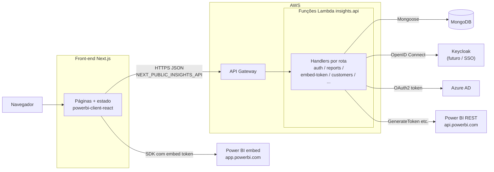
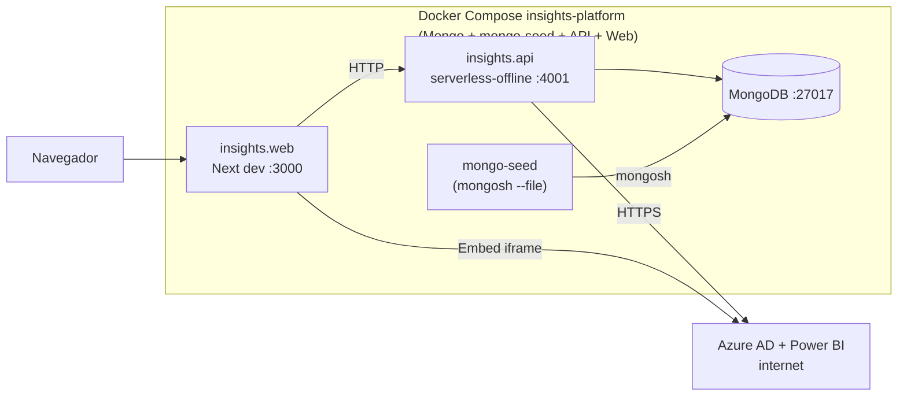
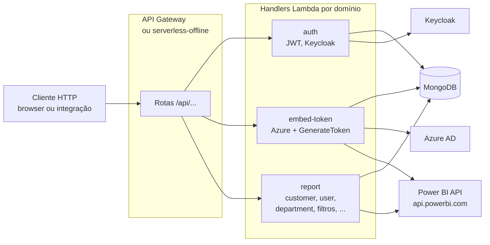
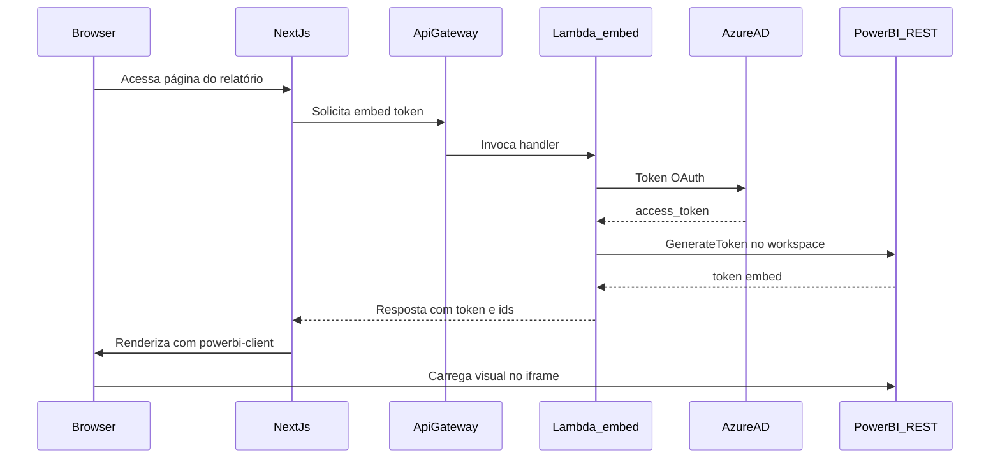

# Arquitetura — Insights Platform

Este documento concentra a visão técnica detalhada da arquitetura. O README da raiz mantém a visão de produto e o caminho rápido para rodar localmente.

---

## Visão geral

O monorepo possui duas aplicações principais:

- **`insights.web`**: frontend Next.js que entrega login, administração e visualização de relatórios.
- **`insights.api`**: API Serverless em TypeScript, empacotada para AWS Lambda e executada localmente via Serverless Offline.

Em produção, o runtime típico é **API Gateway + Lambda** na AWS. Em desenvolvimento local, o **Docker Compose** sobe MongoDB, API em Serverless Offline e Web em Next.js.

---

## Produção — AWS + serviços externos

Em produção não existe um servidor Node long-running chamando Lambdas manualmente. O navegador fala com o **API Gateway**, que invoca o handler Lambda empacotado para cada rota HTTP.

---

## Desenvolvimento local — Docker Compose

A stack local usa Docker Compose para aproximar o fluxo real sem publicar nada na nuvem.

Keycloak **não está em uso neste momento**. Existe preparação no repositório — perfil Compose `keycloak`, `docker/keycloak/import` e [docker/KEYCLOAK.md](../docker/KEYCLOAK.md) — para uma eventual fase futura de SSO corporativo.

---

## API — rotas, handlers e integrações

Cada rota em `serverless.yml` ou `src/modules/**/functions/*.yml` vira um handler empacotado em Lambda. O API Gateway, ou o Serverless Offline local, encaminha o HTTP para essa função.

---

## Sequência — obter token de embed e exibir relatório

---

## Fluxo de embed em passos

1. O front-end pede à API um token ou pacote de embed (`embed-token` ou rota equivalente).
2. A Lambda valida sessão, tenant, usuário e relatório.
3. A Lambda obtém um access token no Azure AD com credenciais configuradas no ambiente.
4. A Lambda chama a REST API do Power BI (`api.powerbi.com`).
5. A API retorna os dados necessários para o front.
6. O Next.js usa `powerbi-client` / `powerbi-client-react` no navegador.
7. O iframe final comunica com `app.powerbi.com`.

Segredos de Azure, Power BI, JWT e banco **não devem** ser hardcoded no repositório.

---

## Nx e deploy independente

O Nx permite CI/CD e desenvolvimento com visibilidade cruzada entre apps em um único repositório, mantendo deploy independente por app.

- Alterações no front não precisam rebuild da API se contratos REST permanecerem compatíveis.
- Alterações na API não precisam rebuild do front quando não mudam contratos consumidos.
- `nx affected` permite executar lint, test e build apenas nos projetos afetados.

Arquivos relevantes:

| Arquivo | Uso |
|---------|-----|
| `nx.json` | Cache, grafo e base para `affected`. |
| `insights.api/project.json` | Targets Nx da API. |
| `insights.web/project.json` | Targets Nx do Web. |
| `package.json` | Workspaces e scripts agregados. |

---

## Links relacionados

- [README raiz](../README.md)
- [insights.api/README.md](../insights.api/README.md)
- [insights.web/README.md](../insights.web/README.md)
- [Power BI](./POWER_BI.md)
- [Autenticação e tenancy](./AUTH_AND_TENANCY.md)
- [Desenvolvimento local](./LOCAL_DEVELOPMENT.md)
