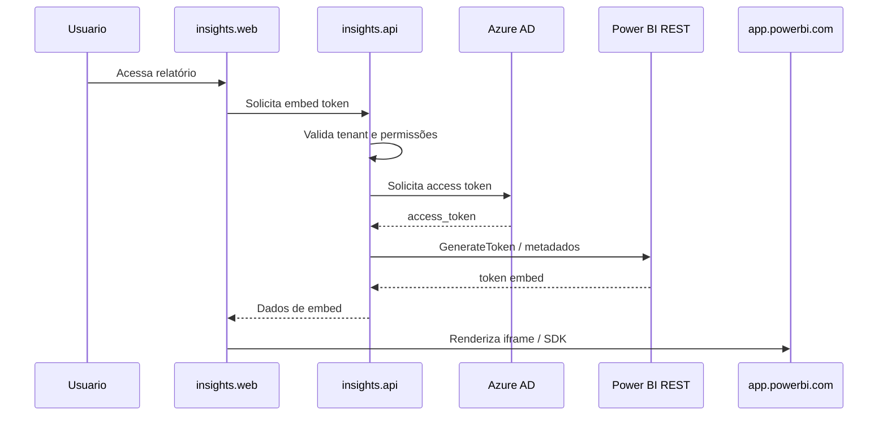

# Power BI e Azure AD

Este documento explica como a Insights Platform integra com Azure AD e Microsoft Power BI para incorporar relatórios no portal.

---

## Resumo

| Item | Papel no produto |
|------|------------------|
| Azure AD | Emite access tokens para chamadas à API do Power BI. |
| Power BI REST API | Gera tokens e metadados para relatórios. |
| Power BI embed | Renderiza relatórios no navegador. |
| `insights.api` | Valida permissões e solicita tokens. |
| `insights.web` | Renderiza o relatório com `powerbi-client-react`. |

Sem credenciais Azure / Power BI reais, a stack local ainda permite testar login, navegação e administração. Fluxos de embed real podem falhar, e isso é esperado.

---

## Fluxo de embed

1. Usuário acessa uma página de relatório no front.
2. Front chama a API pedindo dados de embed.
3. API valida sessão, tenant, usuário e relatório.
4. API obtém token no Azure AD.
5. API chama a Power BI REST API.
6. API retorna token e metadados para o front.
7. Front renderiza o relatório com `powerbi-client-react`.
8. O iframe / SDK conversa com `app.powerbi.com`.

---

## Responsabilidades da API

A API deve:

- validar autenticação JWT;
- validar tenant da sessão;
- validar se o usuário pode acessar o relatório;
- buscar dados necessários no MongoDB;
- obter tokens no Azure AD;
- chamar a Power BI REST API;
- devolver apenas dados necessários para o front.

A API não deve:

- expor secrets ao cliente;
- confiar em tenant enviado arbitrariamente pelo front;
- emitir token para relatório fora do escopo do usuário;
- registrar tokens ou secrets em logs.

---

## Responsabilidades do front

O front deve:

- chamar a API configurada em `NEXT_PUBLIC_INSIGHTS_API`;
- usar o pacote de embed retornado pela API;
- renderizar com `powerbi-client-react` / `powerbi-client`;
- tratar erros de permissão, token ou configuração como estados de UI.

O front não deve:

- armazenar secrets Azure;
- chamar Azure AD diretamente com credenciais sensíveis;
- decidir sozinho se um usuário pode acessar relatório.

---

## Variáveis e configuração

As variáveis exatas dependem dos arquivos de config da API e do ambiente. Em geral, os grupos são:

| Grupo | Uso |
|-------|-----|
| `AZURE_*` | Tenant, client, secret ou credenciais necessárias para Azure AD. |
| Power BI workspace/report | IDs de workspace, report e dataset conforme integração. |
| `NEXT_PUBLIC_EMBED_PBI_APP_URL` | Host usado pelo cliente Power BI no navegador. |
| `NEXT_PUBLIC_INSIGHTS_API` | Base URL da API chamada pelo front. |

Modelos relevantes:

- `.env.docker.example`
- `insights.api/config/local.yml`
- `insights.api/.env.example`
- `insights.web/.env.example`

---

## O que funciona sem Azure / Power BI

Mesmo sem credenciais Microsoft reais, é possível validar:

- subida da stack local;
- login;
- JWT;
- áreas administrativas;
- cadastros locais;
- isolamento por tenant em endpoints que não dependem de chamada externa;
- telas até o ponto em que precisam de embed real.

---

## Falhas esperadas sem configuração externa

| Falha | Quando pode acontecer |
|-------|-----------------------|
| Erro ao gerar token de embed | Azure AD / Power BI não configurado. |
| 401/403 da Microsoft | Credencial inválida ou app sem permissão. |
| Report não carrega no iframe | Token inválido, workspace/report incorreto ou tenant sem acesso. |
| Sincronização Power BI falha | API externa indisponível ou configuração incompleta. |

Essas falhas não indicam necessariamente bug local se as credenciais reais não estiverem configuradas.

---

## Endpoints relacionados

| Grupo | Uso |
|-------|-----|
| `/api/embed-token/...` | Obter dados para embed. |
| `/api/reports/...` | Relatórios, páginas e sincronização. |
| Módulos de filtros | `report-filter`, `target-filter` e associações. |

A lista completa está em `insights.api/serverless.yml` e `insights.api/src/modules/**/functions/*.yml`.

---

## Segurança

- Secrets ficam em variáveis de ambiente, cofre ou configuração segura do ambiente.
- Tokens não devem ser logados.
- A API deve validar tenant e autorização antes de chamar Power BI.
- O front recebe token de embed, não credenciais Azure sensíveis.
- Erros devem ser tratados sem expor stack traces ou segredos.

---

## Links relacionados

- [README raiz](../README.md)
- [Arquitetura](./ARCHITECTURE.md)
- [Autenticação e tenancy](./AUTH_AND_TENANCY.md)
- [insights.api/README.md](../insights.api/README.md)
- [insights.web/README.md](../insights.web/README.md)
