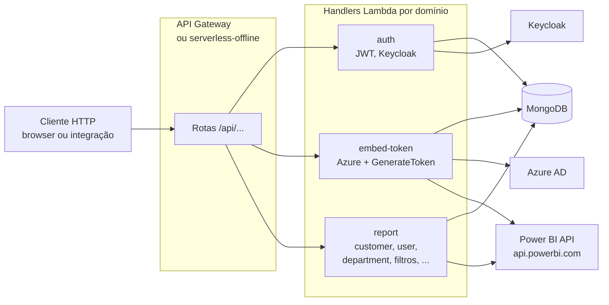
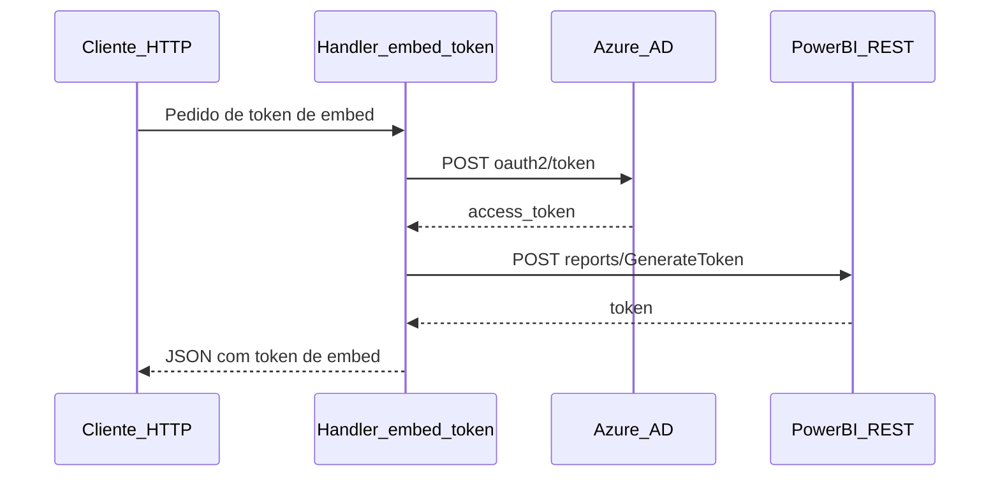

# Insights.api

API serverless (AWS Lambda) em TypeScript, com emulação local via **Serverless Offline**.

## Arquitetura

Cada rota em `serverless.yml` vira um **handler** empacotado em Lambda. O **API Gateway** (ou o plugin **serverless-offline** no seu laptop) encaminha o HTTP para essa função. Vários módulos também chamam **MongoDB**, e o fluxo de **embed** usa **Azure AD** + **Power BI REST** conforme integrações em `src/modules/embed-token/providers/integrations/`.



### Sequência — embed token (trecho do domínio embed-token)



## Stack

| Lib / ferramenta | Uso |
|------------------|-----|
| Serverless Framework 3 | Deploy Lambda + API Gateway |
| Node.js 16.x | Runtime AWS |
| TypeScript | Linguagem |
| MongoDB + Mongoose | Persistência |
| Middy | Middleware HTTP nas Lambdas |
| Axios | Cliente Azure AD / Power BI |
| class-validator / class-transformer | Validação e DTOs |
| Jest | Testes |
| serverless-offline | Emula API + Lambdas no dev |

## Como rodar

### Pré-requisitos

- Node.js 16+
- MongoDB (local ou Docker — veja abaixo)

### Caminho recomendado: stack na raiz do monorepo

Subir **Mongo + API + Web** com um único comando está documentado no [README da raiz](../README.md#como-rodar) (`docker compose` na pasta `insights-platform`).

### Só a API + Mongo (sem Docker Compose da raiz)

1. Suba o Mongo, por exemplo com [docker-compose.yml](./docker-compose.yml) nesta pasta:
   ```bash
   docker compose up -d
   ```
   Conexão típica na sua máquina: `mongodb://127.0.0.1:27017/qa-pbi` (ajuste o nome do banco se precisar).

2. Confira `MONGODB_URI` em [config/local.yml](./config/local.yml). Você pode exportar `MONGODB_URI` no terminal para sobrescrever o valor do arquivo (útil com Docker ou outro host).

3. Instale e inicie o **serverless-offline** (API em **http://localhost:4001**):
   ```bash
   npm install
   npm run dev
   ```

Rotas HTTP seguem o prefixo `/api/...` (ex.: validação de token em `POST /api/auth/validate-token`).

### Script alternativo `dev:local` (Fastify, porta 45000)

Para um servidor Fastify mínimo (algumas rotas de auth mapeadas), use:

```bash
npm run dev:local
```

- Base: **http://localhost:45000**
- Documentação em texto: **GET** `http://localhost:45000/doc`

### Testar invocação “estilo Lambda” no modo Fastify

Com `npm run dev:local` rodando, envie um **POST** para `http://localhost:45000/lambda` com um corpo no formato do evento API Gateway. O campo `path` deve ser **exatamente** um dos caminhos registrados em [server.ts](./server.ts) (sem prefixo `/api`), por exemplo:

```json
{
  "path": "/auth/validate-token",
  "httpMethod": "POST",
  "pathParameters": {},
  "queryStringParameters": {},
  "headers": {},
  "body": "{}"
}
```

Ajuste `body` conforme a rota (string JSON ou objeto serializado, conforme o handler espera).

### Variáveis de ambiente (local)

A configuração padrão do stage `local` está em [config/local.yml](./config/local.yml). Várias chaves aceitam override por variável de ambiente (ex.: `MONGODB_URI`, `KEYCLOAK_URL`, credenciais **Azure** para Power BI). Para desenvolvimento dentro do Docker da raiz do repositório, use o arquivo `.env` descrito em [.env.docker.example](../.env.docker.example).

**Keycloak + seed Mongo (opcional):** na raiz do monorepo use `docker compose --profile keycloak up --build` e siga [.env.docker.example](../.env.docker.example) / [docker/KEYCLOAK.md](../docker/KEYCLOAK.md). Por defeito a stack é só Mongo + API + Web (login clássico).

### Power BI e Azure

Tokens de embed e chamadas à API do Power BI exigem credenciais reais no Azure AD. Sem isso a aplicação sobe, mas fluxos de embed/sincronização podem falhar — isso é esperado.

## Testes

```bash
npm test
npm run test-coverage
npm run lint
```

Detalhes de cenários: expandir suites em `src/**` conforme evolução do projeto.
