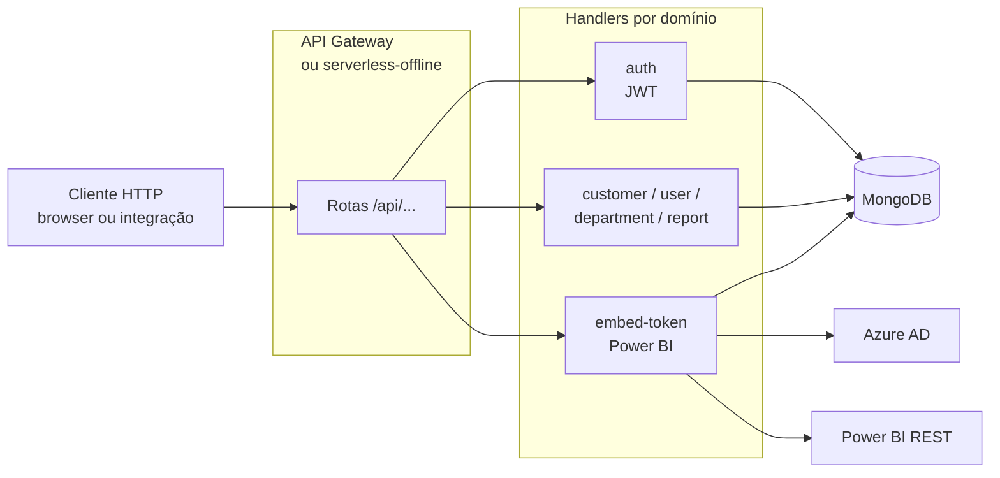

# Insights.api

API Serverless da Insights Platform. Expõe autenticação, administração multi-tenant, relatórios e integração com Power BI.

Em produção, os handlers são empacotados para **AWS Lambda** via Serverless Framework. Em desenvolvimento local, a API roda com **Serverless Offline**.

---

## O que esta API faz

| Domínio | Responsabilidade |
|---------|------------------|
| Auth | Login, JWT, validação de token e fluxo de senha. |
| Tenant | Identificação e isolamento por tenant. |
| Customer | Gestão de clientes. |
| User | Gestão de usuários e vínculos. |
| Department | Gestão de departamentos e permissões. |
| Report | Gestão de relatórios, páginas e associações. |
| Embed token | Validação de acesso e emissão de dados para Power BI embed. |
| Target filters | Filtros e segmentações associadas aos relatórios. |
| Health check | Verificação operacional da API. |

---

## Como rodar

### Caminho recomendado: stack completa da raiz

Para subir MongoDB, API e Web juntos:

```bash
cd ..
cp .env.docker.example .env
docker compose up --build
```

Detalhes: [README da raiz](../README.md#como-rodar-localmente) e [docs/LOCAL_DEVELOPMENT.md](../docs/LOCAL_DEVELOPMENT.md).

### Só API + Mongo

Na pasta `insights.api`:

```bash
docker compose up -d
npm install
npm run dev
```

| Serviço | URL |
|---------|-----|
| API Serverless Offline | [http://localhost:4001](http://localhost:4001) |
| Health check | `GET http://localhost:4001/api/health-check` |
| MongoDB local | `mongodb://127.0.0.1:27017/qa-pbi` |

As rotas seguem o prefixo `/api`.

---

## Login em desenvolvimento

Com seed local aplicado:

| Persona | E-mail | Senha |
|---------|--------|-------|
| Administrador | `admin@example.com` | `DevPass123!` |
| Usuário final | `dev@example.com` | `DevPass123!` |

Teste via API:

```bash
curl -sS -X POST http://localhost:4001/api/auth/sign-in \
  -H "Content-Type: application/json" \
  -H "Origin: http://localhost:3000" \
  -d '{"email":"admin@example.com","password":"DevPass123!"}'
```

O `Origin` é importante porque a API usa esse valor como referência para localizar o tenant. Detalhes: [docs/AUTH_AND_TENANCY.md](../docs/AUTH_AND_TENANCY.md).

---

## Variáveis de ambiente

A configuração padrão do stage local está em [config/local.yml](./config/local.yml). Variáveis podem sobrescrever valores conforme ambiente.

| Variável / grupo | Uso |
|------------------|-----|
| `MONGODB_URI` | Conexão MongoDB. |
| `SECRET_TOKEN` | Assinatura JWT. |
| `SECRET_TOKEN_EXPIRE` | Expiração do JWT. |
| `AZURE_*` | Integração Azure AD / Power BI. |
| `KEYCLOAK_URL` | Deve ficar vazio no fluxo atual sem SSO. |

Para Docker na raiz, use `.env` criado a partir de [../.env.docker.example](../.env.docker.example).

---

## Endpoints principais

| Método | Rota | Auth típica | Descrição |
|--------|------|-------------|-----------|
| GET | `/api/health-check` | Não | Health check. |
| POST | `/api/auth/sign-in` | Não | Login com e-mail e senha. |
| POST | `/api/auth/send-define-password` | Não | Solicita definição / redefinição de senha. |
| POST | `/api/auth/define-password` | Não | Define senha via token. |
| POST | `/api/auth/validate-token` | Varia | Valida JWT. |
| Várias | `/api/customer/...` | Sim | Clientes. |
| Várias | `/api/user/...` | Sim | Usuários. |
| Várias | `/api/department/...` | Sim | Departamentos. |
| Várias | `/api/reports/...` | Sim | Relatórios, páginas e sincronização. |
| Várias | `/api/embed-token/...` | Sim | Dados para embed Power BI. |
| Várias | `/api/target-filter/...` | Sim | Filtros de destino. |

A lista completa está em:

- [serverless.yml](./serverless.yml)
- `src/modules/**/functions/*.yml`

---

## Arquitetura da API

Cada rota declarada no Serverless vira um handler Lambda. Localmente, o Serverless Offline expõe as mesmas rotas por HTTP.



Arquitetura detalhada: [docs/ARCHITECTURE.md](../docs/ARCHITECTURE.md).

---

## Power BI e Azure

Tokens de embed e chamadas à API do Power BI exigem credenciais reais no Azure AD. Sem isso, a API sobe normalmente, mas fluxos de embed e sincronização real podem falhar.

Resumo do fluxo:

1. Front pede dados de embed.
2. API valida usuário, tenant e relatório.
3. API obtém token no Azure AD.
4. API chama Power BI REST.
5. API devolve dados para o front renderizar.

Detalhes: [docs/POWER_BI.md](../docs/POWER_BI.md).

---

## Servidor Fastify alternativo

Para um servidor local mínimo com algumas rotas mapeadas:

```bash
npm run dev:local
```

| Item | Valor |
|------|-------|
| Base URL | `http://localhost:45000` |
| Documentação em texto | `GET http://localhost:45000/doc` |

Esse modo é alternativo ao Serverless Offline e cobre apenas o que está registrado em [server.ts](./server.ts).

---

## Testes e qualidade

```bash
npm test
npm run test-coverage
npm run lint
npm run build
```

Notas:

- Jest roda os testes em `src/**` e testes TypeScript relevantes.
- `npm run build` executa `tsc`.
- Testes de integração com Azure / Power BI real dependem de credenciais externas e ambiente configurado.

---

## Estrutura principal

```text
insights.api/
├── config/                 # Configuração por stage
├── src/
│   ├── commons/            # Tipos e utilitários compartilhados
│   ├── modules/
│   │   ├── auth/
│   │   ├── customer/
│   │   ├── department/
│   │   ├── embed-token/
│   │   ├── report/
│   │   ├── target-filter/
│   │   ├── tenant/
│   │   └── user/
│   └── utils/
├── serverless.yml
├── server.ts               # Modo Fastify alternativo
├── jest.config.ts
└── project.json            # Targets Nx
```

---

## Links relacionados

- [README raiz](../README.md)
- [Desenvolvimento local](../docs/LOCAL_DEVELOPMENT.md)
- [Autenticação e tenancy](../docs/AUTH_AND_TENANCY.md)
- [Power BI](../docs/POWER_BI.md)
- [Arquitetura](../docs/ARCHITECTURE.md)
