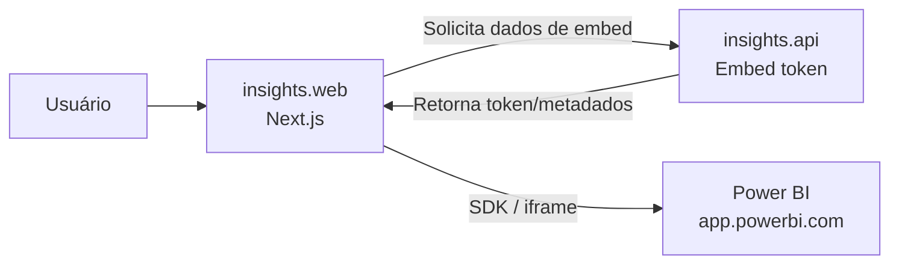
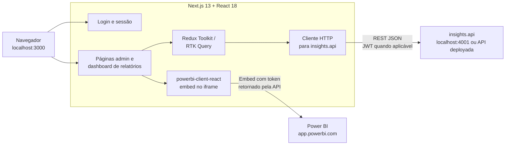

# Insights.web

Interface web da Insights Platform. Entrega login, administração e visualização de relatórios Power BI incorporados.

A aplicação usa **Next.js 13**, **React 18**, **Redux Toolkit / RTK Query**, **Tailwind CSS** e `powerbi-client-react`.

---

## O que esta interface entrega

| Área | Descrição |
|------|-----------|
| Login | Autenticação por e-mail e senha via API. |
| Portal de relatórios | Visualização de relatórios Power BI autorizados. |
| Administração | Telas de clientes, usuários, departamentos, relatórios e configurações. |
| Sessão | Integração com NextAuth e estado global. |
| Integração API | Chamadas REST para `insights.api`. |
| Power BI embed | Renderização no navegador com SDK Power BI. |

---

## Como rodar

### Caminho recomendado: stack completa da raiz

Para subir MongoDB, API e Web juntos:

```bash
cd ..
cp .env.docker.example .env
docker compose up --build
```

Depois acesse [http://localhost:3000](http://localhost:3000).

Detalhes: [README da raiz](../README.md#como-rodar-localmente) e [docs/LOCAL_DEVELOPMENT.md](../docs/LOCAL_DEVELOPMENT.md).

### Rodar só o front

A API precisa estar acessível na URL configurada em `NEXT_PUBLIC_INSIGHTS_API`.

```bash
cp .env.example .env
yarn install
yarn dev
```

Abra [http://localhost:3000](http://localhost:3000).

---

## Login em desenvolvimento

Com a API e o Mongo rodando, e o seed aplicado:

| Persona | E-mail | Senha | Uso |
|---------|--------|-------|-----|
| Administrador | `admin@example.com` | `DevPass123!` | Configurações e gestão. |
| Usuário final | `dev@example.com` | `DevPass123!` | Consumo de relatórios. |

Acesse [http://localhost:3000/login](http://localhost:3000/login).

O login clássico chama `POST /api/auth/sign-in`. O cabeçalho `Origin` enviado pelo navegador é usado pela API para validar o tenant. Detalhes: [docs/AUTH_AND_TENANCY.md](../docs/AUTH_AND_TENANCY.md).

---

## Rotas principais

| Rota | Descrição |
|------|-----------|
| `/login` | Autenticação. |
| `/forgot-password` | Recuperação de senha. |
| `/create-password` | Definição de senha por convite / token. |
| `/settings/*` | Administração: clientes, usuários, relatórios e configurações. |
| `/[[...slugs]]` | Área dinâmica, como dashboard por tenant. |
| `/404` | Página não encontrada. |

A autenticação exata depende dos guards, sessão e implementação em `src/pages`.

---

## Variáveis de ambiente

Veja [`.env.example`](.env.example).

| Variável | Descrição |
|----------|-----------|
| `NEXT_PUBLIC_INSIGHTS_API` | Base URL da API. Ex.: `http://localhost:4001`. |
| `NEXT_PUBLIC_EMBED_PBI_APP_URL` | Host do cliente Power BI. Padrão: `https://app.powerbi.com`. |
| `NEXT_PUBLIC_INSIGHTS_SSO_ENABLED` | `true` habilita SSO na UI; `false` mostra SSO desativado. |
| `NEXTAUTH_URL` | URL pública do front. Ex.: `http://localhost:3000`. |
| `NEXTAUTH_SECRET` | Segredo local do NextAuth. |

Para Docker no monorepo, use o `.env` da raiz criado a partir de [../.env.docker.example](../.env.docker.example).

---

## Integração com a API

O front chama a API por `NEXT_PUBLIC_INSIGHTS_API`.

Fluxo típico:

1. Usuário faz login em `/login`.
2. Front chama `POST /api/auth/sign-in` na API.
3. API retorna JWT.
4. Front guarda estado de sessão conforme implementação atual.
5. Telas autenticadas chamam endpoints de clientes, usuários, departamentos, relatórios e embed.

A API local geralmente roda em:

```text
http://localhost:4001
```

Com prefixo:

```text
/api
```

---

## Integração com Power BI

O front não gera tokens Power BI diretamente. Ele pede os dados para a API e renderiza o relatório com `powerbi-client-react`.



Detalhes: [docs/POWER_BI.md](../docs/POWER_BI.md).

---

## Arquitetura do front



---

## Stack

| Lib | Uso |
|-----|-----|
| Next.js 13 | Framework e roteamento em `src/pages`. |
| React 18 | Interface. |
| TypeScript | Tipagem. |
| Redux Toolkit + RTK Query | Estado global e cache de API. |
| Tailwind CSS + SASS | Estilos. |
| react-hook-form + Yup | Formulários. |
| powerbi-client-react | Embed de relatórios. |
| NextAuth.js | Sessão. |
| lucide-react / Radix | Ícones e componentes acessíveis. |

---

## Estrutura principal

```text
insights.web/
├── src/
│   ├── pages/              # Rotas Next
│   ├── components/         # Componentes de UI
│   ├── services/           # Clientes e integrações
│   ├── store/              # Redux / RTK Query
│   └── styles/             # Estilos globais / SASS / Tailwind
├── Dockerfile.dev
├── project.json            # Targets Nx
├── next.config.js
├── tailwind.config.js
└── .env.example
```

A árvore real pode conter mais arquivos de tooling e configuração.

---

## Testes e qualidade

```bash
yarn lint
yarn test
yarn build
```

O target `test` executa Jest conforme `package.json`. Ao adicionar ou alterar testes do front, manter este README e o target Nx sincronizados.

---

## Next.js

Este projeto foi criado com `create-next-app`. Consulte a documentação oficial do Next.js quando precisar de detalhes específicos do framework.

---

## Links relacionados

- [README raiz](../README.md)
- [insights.api/README.md](../insights.api/README.md)
- [Desenvolvimento local](../docs/LOCAL_DEVELOPMENT.md)
- [Autenticação e tenancy](../docs/AUTH_AND_TENANCY.md)
- [Power BI](../docs/POWER_BI.md)
- [Arquitetura](../docs/ARCHITECTURE.md)
