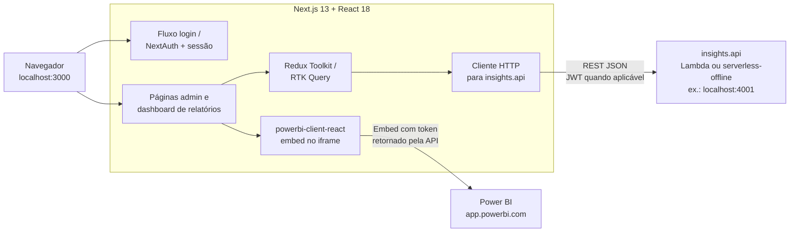

# Insights.web

Interface **Next.js 13** (React 18) da plataforma de relatórios Power BI embutidos.

## Arquitetura

O browser carrega o **Next.js**; páginas e estado (Redux / RTK Query) chamam a **insights.api** via `NEXT_PUBLIC_INSIGHTS_API`. Para relatórios, o fluxo combina **chamadas à API** (tokens, metadados) com o **SDK Power BI no cliente** (`powerbi-client-react`), que conversa com **app.powerbi.com** no iframe.

Estilo de diagrama alinhado ao [README de referência (front Teddy Open Finance)](https://github.com/reluviari/teddy-open-finance-challenge/blob/main/apps/front-end/README.md).



## Stack

| Lib | Uso |
|-----|-----|
| Next.js 13 | Framework e roteamento em `src/pages` |
| React 18 | Interface |
| TypeScript | Tipagem |
| Redux Toolkit + RTK Query | Estado global e cache de API |
| Tailwind CSS + SASS | Estilos |
| react-hook-form + Yup | Formulários |
| powerbi-client-react | Embed de relatórios |
| NextAuth.js | Sessão (variáveis `NEXTAUTH_*`) |
| lucide-react / Radix | Ícones e componentes acessíveis |

## Como rodar

### Pré-requisitos

- Node.js 20+ (alinhado ao [Dockerfile.dev](./Dockerfile.dev))
- Yarn 1.x (ou use `npm`; o repositório versiona `yarn.lock`)
- **API** rodando (geralmente em **http://localhost:4001**) — ver [README da raiz](../README.md#como-rodar)

### Passos

1. Na raiz deste projeto (`insights.web`), crie o arquivo de ambiente:
   ```bash
   cp .env.example .env
   ```

2. Em `.env`, confira pelo menos:
   - `NEXT_PUBLIC_INSIGHTS_API` — URL da API (ex.: `http://localhost:4001` com serverless-offline na sua máquina ou em Docker com portas publicadas nos mesmos valores).
   - `NEXT_PUBLIC_INSIGHTS_SSO_ENABLED` — em dev costuma ser `false` (botão SSO visível mas desativado, com explicação na UI).
   - `NEXTAUTH_URL` — normalmente `http://localhost:3000` em dev.
   - `NEXTAUTH_SECRET` — defina um valor qualquer em desenvolvimento.

3. Instale dependências e suba o servidor de desenvolvimento:
   ```bash
   yarn install
   yarn dev
   ```

4. Abra [http://localhost:3000](http://localhost:3000) no navegador.

### Usar com Docker (monorepo)

Na pasta **pai** (`insights-platform`), use `docker compose`; `NEXT_PUBLIC_*` vêm do `.env` da raiz — [.env.docker.example](../.env.docker.example). O seed de Mongo integra-se na **primeira** inicialização do volume (sem contentor dedicado). **Keycloak não faz parte do uso atual** — [README da raiz](../README.md#como-rodar).

### Power BI no navegador

O cliente embutido usa `NEXT_PUBLIC_EMBED_PBI_APP_URL` (padrão `https://app.powerbi.com`). Relatórios reais dependem da API conseguir emitir tokens **Azure** válidas.

## Rotas principais (páginas)

| Rota | Descrição |
|------|-----------|
| `/login` | Autenticação |
| `/forgot-password` | Recuperação de senha |
| `/create-password` | Definição de senha (convite / token) |
| `/settings/*` | Administração (clientes, usuários, relatórios, etc.) |
| `/[[...slugs]]` | Área dinâmica (ex.: dashboard por tenant) |
| `/404` | Página não encontrada |

(Auth exata depende de guards/NextAuth — validar no código em `src/pages`.)

## Variáveis de ambiente

Veja [`.env.example`](.env.example). Principais:

| Variável | Descrição |
|----------|-----------|
| `NEXT_PUBLIC_INSIGHTS_API` | Base URL da API |
| `NEXT_PUBLIC_EMBED_PBI_APP_URL` | Host do cliente Power BI (embed) |
| `NEXT_PUBLIC_INSIGHTS_SSO_ENABLED` | `true` habilita o botão SSO na `/login` (fluxo OIDC no cliente pode ser completado depois); `false` mostra SSO como desativado com texto explicativo |
| `NEXTAUTH_URL` / `NEXTAUTH_SECRET` | NextAuth |

Para Docker no monorepo: [.env.docker.example](../.env.docker.example).

## Testes e qualidade

```bash
yarn lint
```

(Não há pasta de testes automatizados do front documentada no repositório; acrescente Vitest/Jest conforme padrão da equipe.)

---

## Next.js (referência)

Este projeto foi criado com [`create-next-app`](https://github.com/vercel/next.js/tree/canary/packages/create-next-app). Documentação oficial: [Next.js Documentation](https://nextjs.org/docs).
